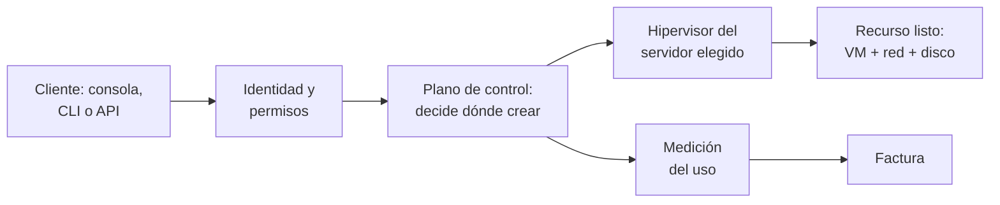
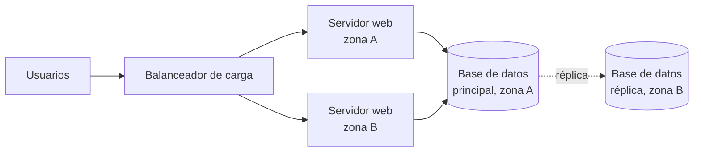
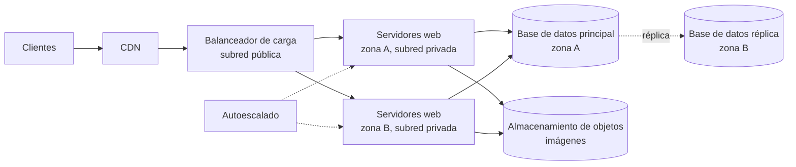

# RA2 — Infraestructura TI: on-premise frente a nube

Módulo 5165 · Metodología DevOps: preparación de entornos

Este documento reúne, en un único Markdown, el material completo del RA2: teoría, enunciados de las actividades y actividades resueltas.

## Índice

1. [RA2 · Teoría](#ra2--teoría)
2. [RA2 · Enunciados](#ra2--enunciados-de-las-actividades)
3. [RA2 · Actividades resueltas](#ra2--actividades-resueltas-y-guía-docente)

---

# RA2 — Infraestructura TI: on-premise frente a nube

2026-09-21 · @Someone

El RA2 se cubre en 12 h (seis sesiones de 2 h): esta pestaña trae la teoría sesión a sesión y las pestañas «RA2 · Enunciados» y «RA2 · Actividades resueltas» las actividades para el alumnado y sus soluciones. Está pensado para portátiles con Ubuntu MATE, parejas de trabajo (grupo de hasta 10), unos 100 min útiles por sesión, nada para casa, y sin depender de Proxmox ni de cuentas cloud; los ejemplos van en AWS y Azure en paralelo para que valga la plataforma que elijas.

## Plan de sesiones

Cada sesión de 2 h se reparte en unos 100 min útiles: 10 de arranque y repaso, 35-40 de teoría, 35-45 de actividad y 10 de cierre y entrega en Aules.

| Sesión | Criterios | Teoría | Actividad (en clase) |
| --- | --- | --- | --- |
| 1 | a | Infraestructura TI, on-premise y nube; definición NIST | Práctica 1: radiografía de un servidor con el portátil |
| 2 | b | Cómo funciona la nube y cómo gana dinero | Práctica 2: coste a 3 años, on-premise frente a nube |
| 3 | c | Beneficios, riesgos y cuándo NO usar la nube | Comité de arquitectura: debate con casos de empresa |
| 4 | d | Infraestructura frente a arquitectura de nube | Investigación guiada (regiones y latencia) + Práctica 3: diagrama |
| 5 | e, f | Servidores, redes, almacenamiento y software | Práctica 4: equivalencias y ruta de una petición + preparar presentaciones |
| 6 | a-f | Repaso | Presentaciones por parejas (40 min) + prueba escrita (50 min) |

## Sesión 1 · Qué es la infraestructura TI: on-premise frente a nube (criterio a)

La infraestructura TI es el conjunto de recursos físicos y lógicos necesarios para ejecutar aplicaciones, y la gran decisión es dónde vive: en instalaciones propias (on-premise) o en la nube, donde se consume como un servicio. El criterio a pide definir la nube y diferenciarla de lo propio; hoy se fija el vocabulario que usará todo el RA.

**Guion de tiempos (40 min):** 10 min infraestructura TI y on-premise · 20 min nube y sus cinco características · 10 min tabla comparativa y cierre. Arranque de sesión (10 min): «¿Dónde están hoy vuestro correo, vuestras fotos y vuestras series? ¿Cuáles de esas cosas están "en la nube" y cuáles en un servidor de alguien?».

### 1. Infraestructura frente a aplicación

Una aplicación (una tienda online, un ERP) es lo que usa la persona; la infraestructura es lo que la hace funcionar. Se compone de:

- **Hardware:** servidores, almacenamiento, equipos de red, y los equipos de energía y refrigeración que los sostienen.
- **Software de base:** sistema operativo, virtualización, herramientas de gestión y monitorización.
- **Servicios de red y seguridad:** direccionamiento, DNS, cortafuegos, accesos.
- **El emplazamiento físico:** desde una sala de servidores hasta un centro de proceso de datos (CPD).

### 2. Infraestructura on-premise (instalaciones propias)

La organización compra o alquila el hardware y lo opera en sus propias instalaciones. Es responsable de todo: adquisición, instalación, energía, refrigeración, seguridad física, redundancia, mantenimiento, actualizaciones y personal. El servidor Proxmox del instituto es un ejemplo cercano de infraestructura propia.

Rasgos que la definen:

- **Propiedad y operación:** el hardware es de la organización (o está dedicado a ella) y lo administra su personal.
- **Modelo económico:** inversión inicial grande (CAPEX: compra de equipos) más costes de operación (OPEX: energía, personal, mantenimiento).
- **Dimensionado para el pico:** se compra pensando en la demanda máxima prevista, con ciclos de renovación de 3 a 5 años.
- **Variantes cercanas:** en el *housing* o *colocation* el hardware es propio pero está en el CPD de un tercero; en el hosting dedicado el hardware es del proveedor pero de uso exclusivo. En sentido estricto, on-premise es lo que se opera dentro de las instalaciones de la organización.

**Anatomía de un CPD.** Además de los racks (armarios con unidades «U» de altura) hay: acometida eléctrica, SAI (baterías) y grupo electrógeno; refrigeración con pasillos fríos y calientes; control de acceso y extinción de incendios; cableado estructurado, conmutadores y cortafuegos. El estándar de referencia habitual clasifica los CPD en niveles Tier I a IV según su redundancia, con disponibilidades orientativas de 99,671 %, 99,741 %, 99,982 % y 99,995 % (Uptime Institute). Para medir la eficiencia energética se usa el PUE: energía total del CPD dividida entre la energía que consumen solo los equipos informáticos; 1,0 sería el ideal y cuanto más cerca, mejor.

### 3. Infraestructura de nube

La definición de referencia es la del NIST ([SP 800-145](https://csrc.nist.gov/publications/detail/sp/800-145/final), 2011): la computación en la nube es un modelo que da acceso por red, cómodo y bajo demanda, a un conjunto compartido de recursos configurables (redes, servidores, almacenamiento, aplicaciones, servicios) que se aprovisionan y liberan rápido con mínimo esfuerzo de gestión o contacto con el proveedor. Lo importante para el aula: **la nube es un modelo de consumo, no un lugar.**

El NIST enumera cinco características esenciales:

| Característica | Qué significa | Cómo se ve en la práctica |
| --- | --- | --- |
| Autoservicio bajo demanda | El cliente crea y elimina recursos sin hablar con nadie | Lanzar una máquina virtual desde el navegador o la API en minutos |
| Acceso amplio por red | Los servicios se usan por red con mecanismos estándar y desde cualquier dispositivo | Consola web, línea de comandos y API |
| Agrupación de recursos | Los recursos del proveedor se comparten entre muchos clientes (multiinquilino) y se asignan de forma dinámica | El cliente elige región o zona, no el servidor físico concreto |
| Elasticidad rápida | Los recursos crecen o se reducen según la demanda, a menudo de forma automática | Para el cliente parecen ilimitados |
| Servicio medido | El uso se mide y se factura; puede monitorizarse | Facturación por hora, por GB o por petición |

### 4. Diferencia esencial

La diferencia no es dónde están los servidores, sino quién los posee y opera y cómo se obtienen y se pagan. Analogía útil: tener tu propio generador eléctrico frente a contratar la red eléctrica y pagar por kWh.

| Aspecto | On-premise | Nube pública |
| --- | --- | --- |
| Propiedad del hardware | La organización | El proveedor |
| Ubicación | Instalaciones propias | Centros de datos del proveedor, en regiones geográficas |
| Quién opera el hardware | Personal propio | El proveedor |
| Cómo se obtiene | Compra, instalación, puesta en marcha (semanas o meses) | Autoservicio (minutos) |
| Cómo se paga | Inversión inicial + costes fijos | Por uso medido |
| Dimensionado | Se calcula de antemano | Se ajusta sobre la marcha |

**Matiz importante:** on-premise no significa «sin nube». Una organización puede montar en sus instalaciones un sistema con autoservicio, agrupación de recursos, elasticidad y facturación por uso; eso es una nube privada on-premise (se estudia en el RA3).

### 5. Contexto histórico (5 min, opcional)

Mainframes y tiempo compartido (años 60-70) → cliente-servidor (años 80-90) → virtualización de servidores x86 (años 2000) → en 2006 Amazon lanza S3 y EC2, el arranque del cloud comercial → Azure sale comercialmente en 2010. Cada paso separa un poco más el recurso de la máquina física.

### Preguntas de comprobación

1. ¿Qué diferencia hay entre una aplicación y su infraestructura? Pon un ejemplo.
2. Nombra tres elementos de un CPD que no sean servidores.
3. Para crear un servidor hay que abrir un ticket y esperar dos semanas: ¿qué característica NIST no se cumple?
4. Una empresa monta en su sala un sistema con autoservicio, elasticidad y cobro interno por uso. ¿Es on-premise o nube? (Ambas: nube privada on-premise.)
5. ¿Por qué se dice que la nube es un modelo de consumo y no un lugar?

## Sesión 2 · Cómo funciona la nube y cómo gana dinero (criterio b)

La nube funciona porque un proveedor invierte en centros de datos enormes con hardware estandarizado, los divide con virtualización y los reparte entre miles de clientes a los que factura solo por lo que usan. El criterio b pide describir ese funcionamiento vinculándolo con el modelo de negocio: las dos mitades se explican a la vez.

**Guion de tiempos (40 min):** 15 min funcionamiento técnico y geografía · 20 min modelo de negocio y formas de pago · 5 min responsabilidad compartida. Arranque (10 min): repaso con las preguntas de comprobación de la sesión 1.

### 1. Qué ocurre cuando pides un recurso

Detrás de un clic hay cuatro piezas: centros de datos con servidores estandarizados, una capa de **virtualización** (hipervisor) que divide cada servidor físico en máquinas virtuales aisladas, un **plano de control** (APIs, planificador, gestión de identidades) que decide qué se crea y dónde, y un sistema de **medición y facturación** que anota el uso.



La ruta se lee de izquierda a derecha y la rama inferior es la que convierte el uso en dinero; esta misma ruta se retoma en la práctica 4.

### 2. Organización geográfica

- **Región:** área geográfica que agrupa varios centros de datos. El cliente elige en qué región viven sus recursos y sus datos, lo que importa para latencia, precio y normativa de protección de datos.
- **Zona de disponibilidad (AZ):** uno o varios centros de datos aislados dentro de una región, con energía y red independientes y conectados entre sí con muy baja latencia. Si una zona cae, las demás siguen funcionando. Azure las ofrece en las regiones que las soportan.
- **Borde (edge):** puntos de presencia cercanos al usuario final, usados sobre todo para servir contenido en caché (CDN).

### 3. El modelo de negocio, pieza a pieza

1. **Economías de escala.** Comprar hardware, energía y refrigeración por volúmenes enormes baja el coste por unidad; algunos proveedores diseñan incluso sus propios procesadores y tarjetas de red (AWS Nitro y Graviton, por ejemplo).
2. **Multiinquilinato.** Los picos de un cliente se compensan con los valles de otro, así que el aprovechamiento medio del hardware es mayor que en un CPD propio, y ese margen es el negocio del proveedor.
3. **Del CAPEX al OPEX.** El proveedor asume la inversión y el cliente paga por uso (*pay-as-you-go*), sin compra inicial.
4. **Qué se factura.** Tiempo de cómputo (por segundo u hora), almacenamiento (GB al mes), tráfico de red (sobre todo el que **sale** de la nube, el *egress*), peticiones u operaciones en servicios gestionados, y soporte.
5. **Formas de comprar el mismo recurso:**
   - Bajo demanda: sin compromiso y el precio de lista más alto.
   - Compromiso de uso a 1 o 3 años (Reserved Instances y Savings Plans en AWS; Reservations y Savings Plans en Azure) a cambio de un descuento.
   - Capacidad sobrante (Spot en AWS, Spot VMs en Azure) con gran descuento, pero el proveedor puede recuperarla con poco aviso.
6. **Servicios gestionados.** El proveedor va más allá de alquilar servidores y vende bases de datos, colas o análisis ya operados, donde el cliente paga por no gestionar.
7. **Retención del cliente.** Los créditos y niveles gratuitos captan clientes y, una vez que los datos y los servicios propios del proveedor están dentro, salir cuesta (dependencia del proveedor y coste de egress); es un riesgo que se retoma en la sesión 3.

**Mini cálculo para la pizarra:** un mes tiene unas 730 horas. Si una máquina virtual cuesta X euros por hora, dejarla encendida todo el mes cuesta 730 × X; apagarla fuera de horario laboral (unas 220 horas al mes, de 10 h × 22 días) baja la cuota a menos de un tercio. Ese es el servicio medido convertido en dinero.

### 4. Responsabilidad compartida y SLA

El proveedor responde de la seguridad **de** la nube (centros de datos, hardware, virtualización); el cliente responde de la seguridad **en** la nube (sus datos, identidades, accesos y configuración). Cuánto le toca a cada uno varía según el tipo de servicio, algo que se detalla en el RA4. El **SLA** es el compromiso de disponibilidad del proveedor (orientativamente entre el 99,9 % y el 99,99 % según la configuración) y su incumplimiento suele compensarse con créditos, no con dinero ni con la recuperación del negocio perdido.

### Preguntas de comprobación

1. Ordena: hipervisor, plano de control, medición del uso, autenticación. ¿Cuál interviene primero?
2. ¿Qué diferencia hay entre región y zona de disponibilidad? ¿Cuál protege de la caída de un centro de datos?
3. Explica con tus palabras por qué el multiinquilinato es rentable para el proveedor.
4. ¿Por qué alguien pagaría más por bajo demanda que por compromiso a 3 años?
5. Tu empresa aloja datos de clientes en la nube: ¿de qué seguridad responde ella y de cuál el proveedor?

## Sesión 3 · Beneficios, riesgos y cuándo no usar la nube (criterio c)

La nube no es mejor por defecto: aporta agilidad, elasticidad y menos inversión inicial, pero introduce costes variables, dependencia del proveedor y obligaciones de cumplimiento, y solo se decide bien comparando ambos modelos con criterios explícitos. Esta sesión prepara el análisis que el alumnado plasmará en el informe de FE, donde está la evidencia evaluable del criterio c.

**Guion de tiempos (35 min):** 15 min beneficios · 10 min límites y riesgos · 10 min cuándo sigue valiendo lo propio y método de decisión. Arranque (10 min): repaso de la sesión 2 con la pregunta «¿cuánto cuesta dejar una máquina encendida un mes?». Después va el Comité de arquitectura (55 min).

### 1. Beneficios frente a on-premise

| Beneficio | Qué aporta | Contraste con lo propio |
| --- | --- | --- |
| Coste | Se pasa de inversión inicial a pago por uso y no se paga capacidad ociosa | En on-premise se compra para el pico y buena parte del año sobra capacidad |
| Elasticidad | La capacidad sube y baja automáticamente con la demanda | Ampliar exige comprar, instalar y esperar |
| Agilidad | Entornos de prueba o producción en minutos; experimentar sale barato | Semanas o meses hasta tener el equipo |
| Disponibilidad | Varias zonas o regiones, copias gestionadas, recuperación ante desastres sin un segundo CPD propio | Replicar un CPD duplica la inversión |
| Alcance global | Desplegar cerca de usuarios de otros países | Requiere presencia física o alquiler de espacio allí |
| Servicios avanzados | Bases de datos, IA, analítica o IoT ya operados | Hay que montarlos y mantenerlos |
| Menos tareas de bajo valor | El equipo deja de comprar racks o cambiar discos y se centra en automatizar y desplegar | El equipo dedica horas a operar hardware |

**Escalabilidad frente a elasticidad.** Escalar es poder crecer: en vertical (más CPU o RAM a un servidor) o en horizontal (más servidores en paralelo). Elasticidad es ajustar esa capacidad automáticamente hacia arriba **y hacia abajo** según la demanda. Ejemplo para la pizarra: una tienda online que vende diez veces más el Black Friday.

**Cuidado con «la nube siempre es más barata».** Una carga estable, predecible y funcionando 24 h durante años, sobre hardware ya amortizado, puede salir más barata en propio. Lo correcto es comparar el **coste total de propiedad (TCO)** a varios años, que es lo que se hace en la práctica 2.

### 2. Límites y riesgos

- **Costes variables e imprevistos:** recursos olvidados encendidos, tráfico de salida, servicios mal dimensionados. Ha nacido una práctica, FinOps, para controlarlo.
- **Dependencia del proveedor (*vendor lock-in*):** cuantos más servicios propietarios se usan, más caro y lento es migrar.
- **Cumplimiento y soberanía del dato:** el RGPD limita las transferencias de datos personales fuera de la UE (la sentencia Schrems II de 2020 anuló el marco anterior con EE. UU. y en 2023 se aprobó otro); el sector público español debe cumplir el Esquema Nacional de Seguridad; y las leyes de terceros países, como la CLOUD Act estadounidense, generan debate sobre el acceso a datos aunque estén en un centro de datos europeo.
- **Conectividad y latencia:** sin Internet no hay acceso, y las cargas que exigen latencia mínima o mueven enormes volúmenes de datos locales pueden encajar mal.
- **Caídas del proveedor:** a veces se cae una zona o una región entera; el cliente no controla la reparación y se protege con arquitectura redundante, que cuesta más.
- **Capacitación y configuración:** una configuración errónea del cliente (un almacenamiento abierto por error, por ejemplo) es una fuente frecuente de brechas de seguridad.

### 3. Cuándo sigue teniendo sentido lo propio

Cargas estables y previsibles a largo plazo con hardware amortizado; datos que por normativa o contrato no pueden salir; latencia extrema o equipos industriales que deben funcionar aunque falle Internet; equipos con la experiencia ya construida. Existen casos públicos de empresas que han repatriado cargas estables desde la nube a infraestructura propia, y muchas organizaciones acaban con un modelo mixto (RA3).

### 4. Método: matriz de decisión ponderada

Cada criterio recibe un peso del 1 al 5 según su importancia para el caso, y cada opción una puntuación del 1 al 5 en ese criterio; se multiplica y se suma. Ejemplo para una startup con lanzamiento incierto:

| Criterio | Peso | On-premise | Nube |
| --- | --- | --- | --- |
| Inversión inicial baja | 5 | 1 | 5 |
| Carga variable | 4 | 2 | 5 |
| Datos sensibles y normativa | 3 | 4 | 3 |
| Experiencia del equipo | 2 | 2 | 3 |
| **Total ponderado** |  | **29** | **60** |

El resultado no sustituye al juicio: sirve para hacer explícitos los criterios y poder discutirlos, que es lo que se practica en el Comité de arquitectura.

### Preguntas de comprobación

1. Diferencia escalabilidad y elasticidad con un ejemplo.
2. ¿Por qué una carga estable 24/7 durante cinco años puede salir más barata en propio?
3. Da dos riesgos de la nube que no existen (o son distintos) en on-premise.
4. Un ayuntamiento quiere alojar padrones de habitantes en la nube: ¿qué dos normas o cuestiones debe mirar antes?
5. Calcula el total ponderado de una opción con pesos 3, 2 y 5 y puntuaciones 4, 5 y 1. (Solución: 3×4 + 2×5 + 5×1 = 27.)

## Sesión 4 · Infraestructura frente a arquitectura de nube (criterio d)

La infraestructura de nube son los recursos que existen (servidores, redes, almacenamiento, virtualización); la arquitectura de nube es el diseño que los combina con servicios para que una aplicación funcione con los requisitos exigidos. Son los ladrillos frente a los planos: con los mismos ladrillos se levantan edificios muy distintos.

**Guion de tiempos (35 min):** 10 min conceptos · 15 min arquitectura de una aplicación web · 10 min requisitos que guían el diseño. Arranque (10 min): repaso de la sesión 3. Después vienen la Investigación guiada (15 min) y la Práctica 3 (35 min).

### 1. Infraestructura de nube

Es el conjunto de recursos de cómputo, red y almacenamiento, junto con la virtualización y el plano de control que los gestiona, sobre los que se ejecutan las cargas de trabajo. Se puede mirar desde dos lados: la infraestructura **del proveedor** (centros de datos, servidores físicos, hipervisores, regiones y zonas) y la infraestructura **del cliente** (las máquinas virtuales, redes virtuales y discos que alquila).

### 2. Arquitectura de nube

Describe cómo se organizan y se conectan los componentes y servicios para lograr un objetivo. Una descripción clásica distingue cuatro partes:

- **Front-end:** lo que usa la persona (navegador, aplicación móvil).
- **Back-end:** servidores, servicios, almacenamiento y aplicaciones que procesan las peticiones.
- **Red y entrega:** Internet, balanceadores, CDN, conexiones privadas.
- **Gestión:** automatización, monitorización y seguridad.

La arquitectura decide, entre otras cosas, cuántos servidores hay, en qué zonas, qué se hace con los datos y cómo se escala. Los estilos habituales son el monolito, las tres capas, los microservicios y la arquitectura sin servidor (esta última se ve en el RA4).

### 3. Arquitectura y ejecución de aplicaciones web

Ejemplo guía para toda la sesión: una tienda online que debe seguir funcionando aunque caiga una zona de disponibilidad.



El dibujo se lee así: las peticiones llegan a un balanceador que las reparte entre dos servidores web en zonas distintas, y ambos hablan con una base de datos que se replica en la otra zona. Cada caja es un **recurso de infraestructura**; el hecho de duplicarlas en dos zonas y repartir el tráfico es **una decisión de arquitectura**.

| Elemento | Recurso de infraestructura (AWS / Azure) | Decisión de arquitectura |
| --- | --- | --- |
| Servidores web | Instancias EC2 / Máquinas virtuales | Cuántas, en qué zonas y con escalado automático |
| Balanceador | Elastic Load Balancing / Azure Load Balancer o Application Gateway | Repartir tráfico y retirar servidores caídos |
| Base de datos | Amazon RDS / Azure SQL Database | Principal más réplica en otra zona |
| Archivos e imágenes | Amazon S3 / Azure Blob Storage | Sacarlos de los servidores para poder crear y destruir estos libremente |
| Red | VPC / Red virtual (VNet) | Subred pública para el balanceador, privadas para servidores y base de datos |

**Dos frases para fijar la diferencia.** Misma infraestructura, arquitecturas distintas: con las mismas tres máquinas virtuales se puede montar un sistema frágil (todo en una máquina) o uno resistente (tres en dos zonas). Misma arquitectura, infraestructuras distintas: el diseño de tres capas puede ejecutarse en un CPD propio o en la nube.

### 4. Qué guía las decisiones de arquitectura

Disponibilidad, escalabilidad, rendimiento, seguridad, coste y facilidad de operación. Los proveedores publican guías para evaluarlas: el **AWS Well-Architected Framework** (seis pilares: excelencia operativa, seguridad, fiabilidad, eficiencia del rendimiento, optimización de costes y sostenibilidad) y el **Azure Well-Architected Framework** (cinco pilares, los mismos salvo la sostenibilidad). Sirven de lista de comprobación al diseñar y son una buena lectura para el alumnado interesado.

En la práctica, la infraestructura acabará descrita como código (infraestructura como código, que se ve en 5166): tanto el diseño como los recursos quedan versionados y repetibles.

### Preguntas de comprobación

Clasifica cada elemento como infraestructura (I) o decisión de arquitectura (A) y justifícalo:

1. Una máquina virtual con 4 vCPU y 16 GB de RAM.
2. Repartir los servidores web entre dos zonas de disponibilidad.
3. Un disco de 200 GB.
4. Poner la base de datos en una subred sin acceso directo desde Internet.
5. Un centro de datos de una región concreta.
6. Guardar las imágenes de la tienda en almacenamiento de objetos en lugar de en el disco del servidor.

Respuestas: 1 I · 2 A · 3 I · 4 A · 5 I · 6 A.

## Sesión 5 · Componentes: servidores, redes, almacenamiento y software (criterios e y f)

Toda infraestructura de nube, propia o de un proveedor, se reduce a cuatro familias de componentes: servidores (cómputo), redes, almacenamiento y el software que los virtualiza y gestiona. El criterio e pide determinar los componentes básicos y relacionarlos con el aprovisionamiento de recursos virtuales y la implementación de cargas; el f, caracterizar cada familia.

**Guion de tiempos (40 min):** 15 min servidores y virtualización · 8 min redes · 10 min almacenamiento · 7 min software y equivalencias. Es la sesión más densa: la profundización de cada bloque la hacen las parejas en sus presentaciones, así que aquí basta con el núcleo. Después van la Práctica 4 (30 min) y la preparación de presentaciones (30 min).

### 1. Mapa general

| Familia | Hardware | Software y lógica | Recurso que ve el cliente |
| --- | --- | --- | --- |
| Servidores | Servidores físicos (CPU, RAM, GPU) en racks | Hipervisor, sistema operativo anfitrión | Máquina virtual o instancia (vCPU + RAM) |
| Redes | Conmutadores, routers, cortafuegos, cableado, enlaces | Redes definidas por software, rutas, reglas, DNS | Red virtual, subredes, IP, grupos de seguridad, balanceadores |
| Almacenamiento | Discos SSD y HDD, servidores y cabinas de almacenamiento | Sistemas distribuidos, replicación, instantáneas | Discos, sistemas de archivos, almacenamiento de objetos |
| Gestión | (el mismo hardware de servidores) | Plano de control, identidades, facturación, monitorización | Consola, línea de comandos y API |

### 2. Servidores

- **Hardware.** Un servidor físico aporta procesadores (núcleos e hilos), memoria RAM, discos locales y tarjetas de red, y a veces aceleradores como GPU. Se monta en racks (formatos 1U, 2U…) o en chasis de láminas (*blade*). Los proveedores usan hardware muy estandarizado, en cantidades enormes.
- **Virtualización.** Un **hipervisor** reparte el hardware entre máquinas virtuales aisladas, cada una con su sistema operativo completo y sus recursos virtuales (vCPU, RAM, disco y tarjeta de red virtuales). El **tipo 1** se ejecuta directamente sobre el hardware (ESXi, Hyper-V, KVM, Xen) y es el que usa la nube; el **tipo 2** corre sobre un sistema operativo de escritorio (VirtualBox, VMware Workstation). AWS usa su sistema Nitro basado en KVM, Azure usa Hyper-V y Proxmox VE usa KVM (y LXC para contenedores ligeros). Los contenedores, en cambio, comparten el núcleo del sistema anfitrión: son más ligeros y son el eje del resto del curso.
- **Tipos de instancia.** Los proveedores ofrecen familias (propósito general, optimizadas para cómputo, para memoria, para almacenamiento, con GPU) y tamaños; una vCPU equivale normalmente a un hilo de ejecución.
- **Aprovisionamiento frente a implementación (criterio e).** *Aprovisionar* es crear los recursos virtuales: elegir imagen (AMI en AWS, imagen de VM en Azure), tipo de instancia, red, disco y claves de acceso. *Implementar la carga* es poner la aplicación a funcionar sobre ellos, a mano, con guiones que se ejecutan al arrancar (cloud-init o *user data*), con contenedores o con infraestructura como código.

### 3. Redes

- **Físicas:** conmutadores, routers, cortafuegos y balanceadores dentro del centro de datos, una red troncal privada entre centros del proveedor y enlaces con el cliente (Internet, VPN o líneas dedicadas como Direct Connect en AWS y ExpressRoute en Azure).
- **Virtuales:** sobre esa red compartida el proveedor crea, por software (redes definidas por software, SDN), una red privada aislada para cada cliente: **VPC** en AWS y **VNet** en Azure. Incluye un rango de direcciones IP privado, subredes (públicas con salida a Internet o privadas), tablas de rutas, puertas de enlace a Internet, traducción de direcciones (NAT), reglas de seguridad (grupos de seguridad en AWS, NSG en Azure), DNS y balanceadores. El detalle práctico de las VPC llega en 5166.

### 4. Almacenamiento

| Tipo | Qué es | Uso típico | AWS / Azure | Equivalente propio |
| --- | --- | --- | --- | --- |
| Bloque | Discos que ve la máquina como si fueran locales; baja latencia | Sistema operativo y bases de datos | EBS / Managed Disks | SAN o discos locales |
| Archivos | Sistema de archivos compartido por red (NFS o SMB) | Carpetas compartidas entre varias máquinas | EFS / Azure Files | NAS |
| Objetos | Datos con metadatos accesibles por HTTP; escala casi ilimitada | Imágenes, copias de seguridad, datos para analítica | S3 / Blob Storage | Ceph o MinIO |

Conceptos que completan el criterio f:

- **Medios y niveles:** SSD (rápidos), HDD (baratos) y cinta o niveles de archivo; los niveles *caliente*, *frío* y *archivo* cambian precio por tiempo de acceso.
- **Durabilidad frente a disponibilidad:** durabilidad es la probabilidad de no perder el dato (AWS declara once nueves para S3 Estándar); disponibilidad es poder acceder a él en cada momento. Se logran replicando entre zonas.
- **Instantáneas y copias:** el almacenamiento en la nube facilita copias programadas, pero las copias en la misma zona no protegen de la caída de la zona.

### 5. Software de la infraestructura

Además del hipervisor, el software clave es el **plano de control** (APIs, planificador, catálogo de imágenes), la gestión de **identidades y accesos** (IAM: usuarios, roles y permisos), la **monitorización y los registros**, la **facturación** y las herramientas de automatización (consola web, CLI, SDK, infraestructura como código). Las mismas ideas se pueden instalar en casa con plataformas como Proxmox VE, OpenStack o VMware vSphere, que dan lugar a nubes privadas.

| Concepto | Proxmox VE (propio) | AWS | Azure |
| --- | --- | --- | --- |
| Máquina virtual | VM (KVM) | Instancia EC2 | Máquina virtual |
| Imagen o plantilla | Plantilla | AMI | Imagen de VM (Azure Compute Gallery) |
| Disco | Volumen (LVM, ZFS, Ceph) | EBS | Managed Disk |
| Red virtual | Bridge y SDN | VPC | VNet |
| Reglas de red | Cortafuegos de Proxmox | Grupo de seguridad | NSG |
| Identidad y permisos | Usuarios, roles y permisos | IAM | Microsoft Entra ID y RBAC |
| Copias de seguridad | vzdump y Proxmox Backup Server | AWS Backup | Azure Backup |
| Monitorización | Métricas del panel | CloudWatch | Azure Monitor |

### Preguntas de comprobación

1. ¿Qué diferencia hay entre un hipervisor de tipo 1 y uno de tipo 2? Da un ejemplo de cada uno.
2. Explica con tus palabras la diferencia entre aprovisionar un recurso e implementar una carga.
3. ¿Qué tipo de almacenamiento elegirías para las imágenes de una tienda online y cuál para el disco de una base de datos? Justifícalo.
4. ¿Qué es una VPC y qué problema resuelve?
5. Una empresa guarda sus copias de seguridad en el mismo centro de datos donde está el servidor: ¿qué riesgo tiene?

## Glosario

| Término | Definición breve |
| --- | --- |
| On-premise | Infraestructura que la organización posee y opera en sus propias instalaciones |
| Housing o colocation | Hardware propio alojado en el centro de datos de un tercero |
| CPD | Centro de proceso de datos: instalación con servidores, energía, refrigeración y seguridad |
| Tier | Nivel (I a IV) que clasifica un CPD por su redundancia y disponibilidad |
| PUE | Energía total del CPD dividida entre la que consumen los equipos informáticos |
| Nube (NIST) | Modelo de acceso por red y bajo demanda a recursos compartidos y configurables, con mínima gestión |
| Multiinquilinato | Varios clientes comparten el mismo hardware con aislamiento entre ellos |
| CAPEX / OPEX | Inversión inicial en activos / gasto recurrente de operación |
| TCO | Coste total de propiedad de una solución a lo largo de varios años |
| Escalabilidad | Capacidad de crecer, en vertical (más potencia) o en horizontal (más servidores) |
| Elasticidad | Ajuste automático de la capacidad hacia arriba y hacia abajo según la demanda |
| Región | Área geográfica que agrupa varios centros de datos de un proveedor |
| Zona de disponibilidad | Uno o varios centros de datos aislados dentro de una región |
| Egress | Tráfico que sale de la nube hacia Internet u otra nube, que suele facturarse |
| SLA | Acuerdo de nivel de servicio: disponibilidad que el proveedor se compromete a ofrecer |
| Responsabilidad compartida | Reparto de la seguridad entre proveedor (de la nube) y cliente (en la nube) |
| Infraestructura de nube | Recursos de cómputo, red y almacenamiento, físicos y virtuales, con su gestión |
| Arquitectura de nube | Diseño que organiza y conecta esos recursos y servicios para una aplicación |
| Hipervisor | Software que reparte el hardware entre máquinas virtuales aisladas |
| Máquina virtual | Ordenador simulado por software con su propio sistema operativo y recursos virtuales |
| vCPU | Procesador virtual asignado a una máquina, normalmente un hilo de ejecución |
| VPC / VNet | Red privada virtual y aislada dentro de AWS / Azure |
| Almacenamiento de bloque, archivos y objetos | Discos para máquinas / carpetas compartidas por red / datos con metadatos accesibles por HTTP |
| Durabilidad | Probabilidad de no perder un dato almacenado |
| Plano de control | Conjunto de APIs y servicios que decide qué recursos se crean y dónde |
| IAM | Gestión de identidades y accesos: quién puede hacer qué |
| SDN | Redes definidas por software: la red se configura por programa, no por cableado |

## Fuentes

- [Real Decreto 144/2026, de 25 de febrero (BOE)](https://www.boe.es/eli/es/rd/2026/02/25/144): resultados de aprendizaje y criterios de evaluación del módulo 5165, consultados el 21 de septiembre de 2026.
- [NIST SP 800-145, The NIST Definition of Cloud Computing](https://csrc.nist.gov/publications/detail/sp/800-145/final): definición, cinco características esenciales, tres modelos de servicio y cuatro de desplieguo (septiembre de 2011).
- [NIST, publicación de la versión final de la definición](https://nist.gov/news-events/news/2011/10/final-version-nist-cloud-computing-definition-published): contexto de la definición.

Lo demás (niveles Tier, PUE, SLA orientativos, durabilidad declarada de S3, pilares de los marcos Well-Architected, equivalencias de servicios entre Proxmox, AWS y Azure) es conocimiento general del sector y no procede de páginas consultadas aquí: los nombres y cifras de los proveedores cambian, así que conviene contrastarlos con su documentación oficial antes de darlos como dato en el aula.


---

# RA2 — Enunciados de las actividades

Siete actividades listas para dar al alumnado, en el orden en que se hacen a lo largo de las seis sesiones; las soluciones y las rúbricas están en la pestaña «RA2 · Actividades resueltas».

## Instrucciones generales

- Trabajáis en **parejas fijas** durante todo el RA2 (si el grupo es impar, se forma un trío). Las parejas se forman en la sesión 1.
- Todo se hace **en clase**. Cada actividad se sube a Aules antes de terminar la sesión; no hay tarea para casa.
- No necesitáis cuenta en AWS ni en Azure: solo terminal, navegador, LibreOffice y diagrams.net, que funciona sin registro.
- Los datos de los escenarios están inventados para el ejercicio. Los precios de la nube los da cada calculadora el día de la práctica.

| Sesión | Actividad | Duración | Nota |
| --- | --- | --- | --- |
| 1 | Práctica 1: radiografía de un servidor | 45 min | Sin nota |
| 2 | Práctica 2: coste a 3 años | 50 min | Trabajo evaluable |
| 3 | Comité de arquitectura | 55 min | Sin nota |
| 4 | Investigación guiada | 15 min | Se entrega dentro de la práctica 3 |
| 4 | Práctica 3: diagrama | 35 min | Trabajo evaluable |
| 5 | Práctica 4: equivalencias y ruta de una petición | 30 min | Trabajo evaluable |
| 5 y 6 | Investigación y presentación | 30 min de preparación y 8 min por pareja | Trabajo evaluable |
| 6 | Prueba escrita | 50 min | Examen |

## Práctica 1 · Radiografía de un servidor

**Sesión 1 · 70 min · En pareja · Se entrega en Aules al terminar la sesión · Actividad sin nota · Criterios a, e y f**

Hoy formáis la pareja con la que trabajaréis todo el RA2. Vuestro portátil es un servidor en miniatura: vais a medirlo, a ponerlo a trabajar y a traducir lo que veáis al vocabulario de la nube.

**1. Medid (15 min).** Abrid una terminal y ejecutad estos comandos, anotando lo que salga de cada uno. El `LANG=C` hace que los nombres aparezcan en inglés y sean iguales en todos los equipos.

```bash
LANG=C lscpu
free -h
lsblk -o NAME,SIZE,TYPE,ROTA,MOUNTPOINT
df -h /
ip -br addr
ip route
systemd-detect-virt
cat /etc/os-release
```

**2. Completad la ficha (10 min).** Copiad la tabla en vuestro documento y rellenad las dos últimas columnas.

| Recurso | Valor en mi portátil | Cómo se llama en la nube |
| --- | --- | --- |
| Núcleos e hilos |  |  |
| Memoria RAM |  |  |
| Disco: tamaño y tipo (ROTA 0 es SSD) |  |  |
| Interfaz de red e IP |  |  |
| Puerta de enlace |  |  |
| ¿Está virtualizado? |  |  |

**3. Alquilad un equivalente (10 min).** En la documentación pública de AWS (tipos de instancia de EC2) y de Azure (tamaños de máquina virtual), buscad el tamaño más parecido a vuestro portátil y anotad, para cada proveedor, el nombre del tamaño, las vCPU y la RAM.

**4. Medid el uso (10 min).** Ejecutad lo siguiente y haced una captura de pantalla de cada salida de `top`. El bucle pone todos los números al 100 % durante 20 segundos.

```bash
nproc
top -bn1 | head -12
for i in $(seq $(nproc)); do timeout 20 sh -c 'while :; do :; done' & done; sleep 5; top -bn1 | head -12; wait
```

Anotad el porcentaje de CPU antes y durante la carga. Después responded: si esta máquina fuera una máquina virtual normal en la nube y estuviera encendida una hora, ¿cambiaría lo que pagáis entre haberla tenido al 5 % o al 100 % de CPU? ¿Y si la apagáis?

**5. Vuestro «mini centro de datos» (10 min).** En papel o en diagrams.net, dibujad el portátil como si fuera un centro de datos: qué hace de servidor, de red, de almacenamiento, de SAI (la batería), de refrigeración (el ventilador) y de seguridad física (la contraseña, la tapa). Marcad en rojo lo que le falta para ser un centro de datos de verdad.

**6. Responded por escrito (15 min).**

1. ¿Qué le pasa al servicio que ejecuta este equipo si se rompe su disco?
2. Nombrad al menos tres elementos de un centro de datos que no aparecen en vuestro portátil pero que una empresa con servidores propios tendría que comprar y mantener. En la nube, ¿quién se ocupa de ellos?
3. ¿Qué devuelve `systemd-detect-virt` en vuestro equipo y qué devolvería dentro de una instancia de la nube? ¿Qué diferencia eso de un servidor físico?
4. De todo lo que habéis medido, ¿qué cambiaría de responsable (proveedor o cliente) si el servicio pasara a la nube?

**Qué hay que entregar.** Un documento (ODT o PDF) con los nombres de la pareja, la ficha completa, los dos tamaños elegidos, las capturas de `top`, el dibujo del mini centro de datos y las respuestas, subido a Aules antes de terminar la sesión.

**Cómo se valora.** No lleva nota: el profesor os devolverá comentarios y se comentarán algunos resultados en voz alta al final.

## Puzle A · Cómo funciona la nube y cómo gana dinero

**Sesión 2 · 85 min · Grupos de 5 y parejas de expertos · Se entrega en Aules al terminar la sesión · Trabajo evaluable · Criterio b**

Hoy no hay clase magistral: sois vosotros quienes investigáis y os enseñáis unos a otros (es un «puzle de Aronson»). Cada persona se convierte en experta en un tema y después lo explica a su grupo; nadie conoce el puzle completo hasta que todos han enseñado su pieza.

**Cómo funciona el puzle**

| Fase | Minutos | Qué ocurre |
| --- | --- | --- |
| 0. Reparto | 5 | El profesor forma dos grupos base de 5 personas. En cada grupo, cada persona recibe un número del 1 al 5, que es su tema |
| 1. Expertos | 25 | Se juntan las dos personas que tienen el mismo número (una de cada grupo base). Investigáis con la hoja de experto y preparáis vuestra ficha |
| 2. Enseñar | 30 | Cada persona vuelve a su grupo base y explica su tema en 5 minutos, más 1 de preguntas. Quien escucha completa la ficha de recogida |
| 3. Comprobar | 10 | Prueba individual de 5 preguntas, en papel, con vuestra ficha de recogida |
| 4. Cierre | 10 | El profesor aclara dudas y corrige los errores más frecuentes |

Para investigar podéis usar el navegador y la documentación oficial de AWS y de Azure, además de lo que indique cada hoja. No hay apuntes del profesor: la fuente sois vosotros.

**Los cinco temas: hojas de experto**

| Tema | Preguntas que debe responder la pareja de expertos | Dónde buscar |
| --- | --- | --- |
| 1. Geografía de la nube: regiones, zonas y borde | ¿Qué es una región? ¿Qué es una zona de disponibilidad y para qué sirve? ¿Qué es el borde (edge)? ¿Cuál es la región de AWS y la de Azure más cercana a nuestro centro y cuántas zonas tienen? ¿A qué latencia están la más cercana, una de Estados Unidos y una de Asia-Pacífico (medidlo)? ¿Qué pesa, además de la latencia, al elegir región? | Páginas de infraestructura global de AWS y de Azure; herramientas públicas de latencia como cloudping.info y azurespeed.com |
| 2. Economías de escala y multiinquilinato | ¿Por qué comprar hardware en enormes cantidades baja el coste por unidad? ¿Qué es el multiinquilinato y cómo se aísla a cada cliente? ¿Por qué los picos de unos clientes y los valles de otros hacen rentable el negocio? ¿Qué hardware propio diseñan los proveedores? | Documentación oficial de AWS Nitro System; búsqueda de «hyperscale data center economies of scale» y «cloud multi-tenancy isolation» |
| 3. Cómo se paga: modalidades y facturación | ¿Qué es pagar bajo demanda? ¿Qué son los compromisos de uso a 1 y 3 años? ¿Qué es la capacidad Spot? ¿Qué se factura en un servicio típico: cómputo, almacenamiento, tráfico, peticiones? Calculad con la calculadora de AWS y la de Azure el coste mensual de una máquina de 2 vCPU y 8 GB en las tres modalidades y apuntad la fecha | Calculadoras de precios oficiales; páginas de precios de EC2 y de Azure Virtual Machines |
| 4. Responsabilidad compartida y SLA | ¿Qué significa seguridad «de» la nube y seguridad «en» la nube? Dibujad el reparto entre proveedor y cliente. ¿Qué disponibilidad se compromete a dar el proveedor para una máquina virtual y en qué configuración? ¿Qué recibe el cliente si no la cumple? ¿Qué errores del cliente provocan brechas de seguridad? | Búsqueda de «AWS shared responsibility model» y «Azure shared responsibility»; páginas de SLA de ambos proveedores |
| 5. Servicios gestionados y retención del cliente | ¿Qué es un servicio gestionado? Poned un ejemplo con base de datos. ¿Por qué al proveedor le interesa vender servicios gestionados? ¿Qué son los niveles gratuitos y los créditos? ¿Qué es la dependencia del proveedor y qué papel tiene el coste de sacar datos (egress)? | Páginas de Amazon RDS y de Azure SQL Database; búsqueda de «AWS Free Tier», «Azure free account» y «egress fees» |

**La ficha de experto (la prepara la pareja en la fase 1).** Un folio con: qué es el tema en una frase; cómo funciona, con un dibujo hecho por vosotros; un ejemplo en AWS y otro en Azure; un dato verificable con su fuente y su fecha; y tres preguntas para comprobar que los demás lo han entendido, con su respuesta. Se sube a Aules y el profesor la reparte a toda la clase.

**La ficha de recogida (la rellena cada persona en la fase 2).**

| Tema | Idea principal en una frase | Dos cosas que no sabía | Una duda que me queda |
| --- | --- | --- | --- |
| 1. Geografía de la nube |  |  |  |
| 2. Economías de escala y multiinquilinato |  |  |  |
| 3. Cómo se paga |  |  |  |
| 4. Responsabilidad compartida y SLA |  |  |  |
| 5. Servicios gestionados y retención |  |  |  |

**La prueba individual (fase 3).** Cinco preguntas, una por tema. Algunas saldrán de las que hayáis propuesto en vuestras fichas de experto.

**Qué hay que entregar.** La ficha de experto de la pareja, la ficha de recogida de cada persona y la prueba individual.

**Cómo se valora.** Es un trabajo evaluable: la ficha de experto (contenido correcto, estructura, fuentes y preguntas), la explicación a vuestro grupo (la observa el profesor y os valoran vuestros compañeros con una hoja de tres casillas: claro, ordenado y responde preguntas) y la prueba individual.

## Práctica 2 · Coste a 3 años, on-premise frente a nube

**Sesión 2 · 50 min · En pareja · Se entrega en Aules al terminar la sesión · Trabajo evaluable · Criterio b**

Una pyme quiere alojar una web corporativa con una API. Debéis calcular cuánto le cuesta hacerlo durante tres años con un servidor propio y en la nube, y decidir qué opción recomendaríais y con qué límites.

**Lo que necesita la aplicación (datos ficticios).** 2 vCPU y 8 GB de RAM, 200 GB de disco SSD, 1 TB al mes de tráfico saliente hacia Internet, copias de seguridad de 200 GB y funcionamiento continuo (730 horas al mes).

**Opción A · Servidor propio.** Trabajad con estos datos, inventados para el ejercicio; podéis cambiarlos si lo justificáis.

| Concepto | Dato |
| --- | --- |
| Servidor | 3.200 € (compra inicial) |
| SAI | 500 € (compra inicial) |
| Disco externo para copias | 200 € (compra inicial) |
| Consumo medio | 250 W durante 730 h al mes |
| Electricidad | 0,20 €/kWh, con un 30 % extra por refrigeración |
| Línea de Internet profesional con IP fija | 60 €/mes |
| Servicio de copias remoto | 20 €/mes |
| Garantía y mantenimiento | 10 % del precio del hardware al año |
| Administración | 10 % de la jornada de un técnico cuyo coste para la empresa es de 36.000 €/año |

**Opción B · Nube.** Usad la calculadora de precios pública de AWS y la de Azure (no hace falta iniciar sesión). Añadid una máquina virtual Linux con 2 vCPU y 8 GB funcionando 730 horas al mes, un disco de 200 GB, 1 TB al mes de tráfico saliente y 200 GB de copias, en una región de la UE. La administración se estima en el 5 % de la jornada del mismo técnico.

**Qué tenéis que hacer**

1. **Calcular (20 min).** Obtened el coste mensual y el acumulado a 36 meses de la opción A y de la opción B en tres modalidades: bajo demanda, con compromiso a 1 año y con compromiso a 3 años. Si una calculadora no ofrece alguna modalidad, dejadlo anotado. Guardad una captura o exportación de cada resultado.
2. **Hoja de cálculo (15 min).** En LibreOffice Calc, montad una tabla con los costes por año y acumulados, y un gráfico de líneas con el coste acumulado mes a mes de cada opción. Si las líneas se cruzan, marcad el punto de equilibrio.
3. **Y si… (10 min).** Elegid una de estas variaciones, estimad su efecto sobre las dos opciones y explicad por qué: apagar la máquina fuera del horario laboral (unas 220 horas al mes en marcha), una campaña con demanda triplicada durante dos meses, o una subida del 50 % en la electricidad.
4. **Conclusiones (5 min).** Cinco líneas: qué recomendáis, por qué, y qué cosas importantes **no** han entrado en el cálculo.

**Qué hay que entregar.** El archivo de la hoja de cálculo (con tablas y gráfico), las capturas de las calculadoras y las conclusiones, subidos a Aules antes de terminar la sesión.

**Cómo se valora.** Es un trabajo evaluable con la rúbrica común de las prácticas (0 a 8 puntos): corrección técnica, justificación, vocabulario y entrega.

## Comité de arquitectura

**Sesión 3 · 55 min · En pareja · Se entrega en Aules al terminar la sesión · Actividad sin nota · Criterio c**

Sois una consultora tecnológica. Cada pareja recibe el caso de una organización y debe recomendar, ante el resto de la clase (el «comité»), dónde debería vivir su infraestructura: en instalaciones propias o en la nube. El profesor asigna los casos por sorteo.

**Los casos (datos ficticios)**

| Caso | Situación |
| --- | --- |
| 1. Startup de reparto | App móvil que lanza en tres ciudades con demanda muy incierta; equipo de cuatro personas sin administrador de sistemas; poco capital |
| 2. Hospital público regional | Historia clínica electrónica y sistemas 24/7; datos de salud; hardware actual amortizado; equipo TI propio pequeño |
| 3. Tienda online con campañas | Ventas estables casi todo el año y picos de diez veces en dos campañas; catálogo de 20.000 productos |
| 4. Ayuntamiento mediano | Sede electrónica y padrón; obligación de cumplir el Esquema Nacional de Seguridad; presupuesto anual cerrado y contratación por licitación; poca plantilla técnica |
| 5. Fábrica con líneas de producción | Control de planta que no puede parar aunque falle Internet; datos de sensores que se analizan en diferido |

**Qué tenéis que hacer**

1. **Construid la matriz de decisión (15 min).** Copiad la tabla, dad a cada criterio un peso del 1 al 5 según lo importante que sea **en vuestro caso**, y puntuad del 1 a 5 cada opción en cada criterio. Podéis añadir un criterio propio. Después multiplicad cada puntuación por su peso y sumad para obtener el total de cada opción.

| Criterio | Peso (1-5) | On-premise (1-5) | Nube (1-5) |
| --- | --- | --- | --- |
| Inversión inicial |  |  |  |
| Coste a cinco años |  |  |  |
| Variabilidad de la carga |  |  |  |
| Requisitos legales y de datos |  |  |  |
| Latencia y conectividad |  |  |  |
| Capacidades del equipo |  |  |  |
| Riesgo de dependencia del proveedor |  |  |  |
| Tiempo de puesta en marcha |  |  |  |
| Criterio propio: |  |  |  |
| **Total ponderado** |  |  |  |

2. **Redactad la recomendación (incluida en los 15 min).** Tres líneas: qué opción recomendáis y qué criterios la decidieron. Si pensáis que una parte de los sistemas debería quedarse en propio, explicad cuál y por qué; no hace falta que conozáis todavía el modelo híbrido.
3. **Exponed ante el comité (30 min en total para todas las parejas).** Cada pareja presenta su caso y su recomendación en 3 minutos. La pareja siguiente actúa de **abogado del diablo**: plantea una objeción en 2 minutos y la primera responde.
4. **Cerrad con el profesor (10 min).** Se comenta en la pizarra qué criterio pesó más en cada caso y qué patrones aparecen.

**Qué hay que entregar.** La matriz completa y la recomendación de tres líneas en un documento o en una foto legible, subidos a Aules antes de terminar la sesión.

**Cómo se valora.** No lleva nota. Lo importante es que los pesos estén justificados por el caso y que la recomendación se apoye en la matriz; el análisis de beneficios y riesgos de la nube lo haréis con datos reales en el informe de la empresa.

## Investigación guiada · ¿Dónde viven mis datos?

**Sesión 4 · 15 min · En pareja · El resultado se entrega dentro de la práctica 3 · Criterios b y d**

Antes de dibujar la arquitectura tenéis que decidir en qué región de la nube vais a desplegarla, y hacerlo con datos y no por intuición.

1. **Localizad (6 min).** En las páginas públicas de infraestructura global de AWS y de Azure, buscad la región más cercana a vuestro centro. Anotad su nombre, su país, cuántas zonas de disponibilidad declara AWS y si Azure ofrece zonas de disponibilidad en esa region.
2. **Medid (6 min).** Con una herramienta pública de medición de latencia desde el navegador para AWS (por ejemplo cloudping.info) y otra para Azure (por ejemplo azurespeed.com), medid la latencia hacia tres regiones y rellenad la tabla.

| Región | Proveedor | Latencia medida (ms) |
| --- | --- | --- |
| La más cercana a nosotros |  |  |
| Una de Estados Unidos |  |  |
| Una de Asia-Pacífico |  |  |

3. **Decidid (3 min).** Escribid una frase con la región que usaréis en la práctica 3 y por qué. La más cercana no siempre es la mejor elección: pensad en el precio, en los servicios disponibles y en dónde exige la normativa que estén los datos.

**Qué hay que entregar.** La información de la región, la tabla y la frase, pegadas al principio del documento de la práctica 3.

## Práctica 3 · Diagrama de infraestructura y arquitectura

**Sesión 4 · 35 min · En pareja · Se entrega en Aules al terminar la sesión · Trabajo evaluable · Criterio d, con apoyo de e y f**

Dibujad la arquitectura en la nube de la organización que defendisteis en el Comité, y distinguid con claridad qué son recursos de infraestructura y qué son decisiones de arquitectura. Usad diagrams.net en el navegador (funciona sin registro) y elegid un proveedor, AWS o Azure, con su biblioteca de iconos.

**El diagrama debe incluir como mínimo**

- La región elegida en la investigación guiada y **dos** zonas de disponibilidad dentro de ella.
- Una red virtual con al menos una subred pública y una privada.
- Una capa web con dos o más servidores repartidos entre las zonas y un balanceador de carga delante.
- Una base de datos con réplica en otra zona (o una razón escrita de por qué vuestro caso no la necesita).
- Almacenamiento de objetos para archivos estáticos o copias de seguridad.
- Al menos **cuatro decisiones de arquitectura** señaladas con un número sobre el propio dibujo.

**Qué tenéis que hacer**

1. **Dibujad (20 min).** Los elementos como iconos, las zonas y subredes como contenedores y las conexiones entre ellos.
2. **Clasificad (10 min).** Debajo del diagrama, poned una tabla con una fila por elemento o por decisión numerada.

| Elemento o número | ¿Infraestructura (I) o decisión de arquitectura (A)? | Justificación en una frase | Qué exigiría en on-premise |
| --- | --- | --- | --- |
|  |  |  |  |

3. **Revisad (5 min).** Intercambiad el diagrama con otra pareja. Vuestros compañeros marcarán en rojo cualquier punto único de fallo que vean, y vosotros lo corregiréis.

**Qué hay que entregar.** El diagrama exportado a PNG o PDF junto con el archivo `.drawio`, la tabla de clasificación y la información de la investigación guiada, subidos a Aules antes de terminar la sesión.

**Cómo se valora.** Es un trabajo evaluable con la rúbrica común de las prácticas (0 a 8 puntos). Se valora sobre todo que no confundáis regiones con zonas, que la base de datos no quede accesible directamente desde Internet y que las decisiones numeradas sean elecciones de diseño (cuántas, dónde, qué separa qué) y no simples nombres de recursos.

## Práctica 4 · Equivalencias y ruta de una petición

**Sesión 5 · 30 min · En pareja · Se entrega en Aules al terminar la sesión · Trabajo evaluable · Criterios e y f**

Dos ejercicios cortos para relacionar lo que tiene un centro de datos propio con lo que ofrece la nube, y para entender qué ocurre por dentro cuando se pide un recurso virtual.

**Parte 1 · Del centro de datos propio a la nube (15 min).** Completad la tabla con el servicio o concepto equivalente en AWS o en Azure (elegid uno de los dos y mantenedlo en toda la tabla) y con quién lo opera en la nube: el proveedor, el cliente o ambos.

| Elemento de un centro de datos propio | Equivalente en la nube | ¿Quién lo opera? |
| --- | --- | --- |
| SAI y grupo electrógeno |  |  |
| Rack con servidor físico |  |  |
| Discos SAN de las máquinas virtuales |  |  |
| NAS con carpetas compartidas |  |  |
| Cortafuegos perimetral y sus reglas |  |  |
| VLAN para separar redes |  |  |
| Servidor DNS |  |  |
| Hipervisor (Proxmox, ESXi) |  |  |
| Discos o cintas de copias de seguridad |  |  |
| Ticket a sistemas para pedir un servidor |  |  |

**Parte 2 · Ruta de una petición (15 min).** Estos ocho pasos describen lo que pasa desde que una persona pide una máquina virtual hasta que se empieza a facturar, pero están desordenados.

- A. Se empieza a contar el uso de la máquina para la factura.
- B. El plano de control elige un servidor físico con capacidad libre.
- C. La persona pide la máquina desde la consola, la CLI o la API.
- D. El hipervisor de ese servidor crea la máquina virtual con sus vCPU y su RAM.
- E. Se comprueba la identidad y que la persona tiene permiso y cuota.
- F. La máquina arranca y queda en estado «en ejecución».
- G. Se copia la imagen elegida al disco virtual de la máquina.
- H. Se conecta la máquina a la red virtual y se le asigna una IP privada.

Ordenadlos y, para cada paso, indicad qué componente actúa (plano de control, hipervisor, servidor físico, red o almacenamiento) y qué característica NIST ilustra, si alguna. Después responded:

1. ¿En qué paso decide el proveedor qué servidor físico se usa, y por qué el cliente normalmente no lo ve?
2. ¿Qué se aprovisiona en los pasos D, G y H y qué falta todavía para **implementar la carga** de una aplicación?

**Qué hay que entregar.** La tabla completa, el orden de los pasos con sus etiquetas y las respuestas, subidos a Aules antes de terminar la sesión.

**Cómo se valora.** Es un trabajo evaluable con la rúbrica común de las prácticas (0 a 8 puntos).

## Investigación y presentación por parejas

**Preparación en la sesión 5 (30 min) · Exposición en la sesión 6 (6 min por pareja más 2 de preguntas) · En pareja · Trabajo evaluable · Criterios e y f, y b en el tema 5**

Cada pareja investiga un tema con documentación oficial y lo explica al resto de la clase. Todo se prepara en clase durante estos 30 minutos y en los 10 primeros minutos de la sesión 6; no hay tarea para casa. El profesor asigna los temas por sorteo.

**Los temas**

| Tema | Qué tiene que aparecer como mínimo |
| --- | --- |
| 1. Un centro de datos por dentro | Energía, refrigeración, seguridad física, niveles Tier y PUE; qué hace una empresa en propio y qué un proveedor de gran escala |
| 2. Virtualización e hipervisores | Cómo un servidor físico se convierte en decenas de máquinas; tipo 1 y tipo 2; KVM, Hyper-V y ESXi; máquina virtual frente a contenedor |
| 3. La red de la nube | VPC o VNet, subredes, rutas, seguridad y conexión con la red de la empresa |
| 4. El almacenamiento | Bloque, archivos y objetos; niveles de acceso; durabilidad frente a disponibilidad; qué se usa para qué |
| 5. Cómo gana dinero la nube | Economías de escala, formas de pago, tráfico de salida, compromisos y gestión de costes |

**Estructura obligatoria: máximo 6 diapositivas**

1. Qué es, en una sola frase.
2. Cómo funciona, con un dibujo hecho por vosotros.
3. Equivalencia en on-premise, AWS y Azure.
4. Un caso real o un dato verificable, con su fuente.
5. Una pregunta para la clase.
6. Fuentes: al menos dos, con enlace, y preferentemente documentación oficial.

**Reglas**

- Se prepara con LibreOffice Impress y se sube en PDF a Aules antes de empezar la exposición.
- Las dos personas de la pareja hablan al menos 2 minutos cada una.
- No se leen las diapositivas.
- Durante las exposiciones de los demás, cada persona anota en una tarjeta una cosa que ha aprendido y una duda, y se la entrega al profesor.

**Cómo se valora.** Con una rúbrica de 0 a 10 puntos que mira: contenido técnico, explicación propia (el dibujo), equivalencias, fuentes y dato verificable, y exposición y respuesta a preguntas.

## Sesión 6 · Presentaciones y prueba escrita

**Sesión 6 · 100 min útiles · Criterios b, d, e y f**

| Minutos | Qué se hace |
| --- | --- |
| 0 a 10 | Últimos retoques a la presentación y subida del PDF a Aules |
| 10 a 50 | Exposiciones por parejas, en el orden del sorteo: 6 minutos de exposición y 2 de preguntas por pareja |
| 50 a 100 | Prueba escrita individual, en papel y sin apuntes |

**Qué entra en la prueba.** Todo lo trabajado en las sesiones 2 a 5 sobre los criterios b, d, e y f: el funcionamiento de la nube y su modelo de negocio, la diferencia entre infraestructura y arquitectura de nube, y los componentes de servidores, redes, almacenamiento y software. Tendrá preguntas tipo test, preguntas cortas y un pequeño caso con un diagrama.

**Cómo prepararse en clase.** Repasad las preguntas de comprobación con las que empieza cada sesión, vuestras prácticas 2, 3 y 4 y las tarjetas de dudas de las presentaciones, que el profesor usará para el repaso previo.


---

# RA2 — Actividades resueltas y guía docente

Soluciones modelo de las siete actividades y de las preguntas de comprobación de la teoría, con las rúbricas y el reparto de evaluación al final; los enunciados que se dan al alumnado están en la pestaña «RA2 · Enunciados». Los precios de nube que aparecen en la práctica 2 son supuestos ilustrativos para mostrar el método, no precios reales: sustitúyelos por los de las calculadoras el día de la práctica.

## Mapa de actividades

| Sesión | Actividad | Min | Formato | Criterios | Cómo cuenta |
| --- | --- | --- | --- | --- | --- |
| 1 | Práctica 1: radiografía de un servidor | 45 | Pareja, terminal | a, e, f | Formativa |
| 2 | Práctica 2: coste a 3 años | 50 | Pareja, hoja de cálculo | b | Trabajo evaluable |
| 3 | Comité de arquitectura | 55 | Pareja, debate | c | Formativa |
| 4 | Investigación guiada | 15 | Pareja, navegador | b, d | Se integra en la práctica 3 |
| 4 | Práctica 3: diagrama | 35 | Pareja, diagrama | d | Trabajo evaluable |
| 5 | Práctica 4: equivalencias y ruta de una petición | 30 | Pareja | e, f | Trabajo evaluable |
| 5 y 6 | Investigación y presentación | 30 + 40 | Pareja | e, f | Trabajo evaluable |
| 6 | Prueba escrita | 50 | Individual | b, d, e, f | Examen |

**Reglas comunes.**

- Cinco parejas fijas durante todo el RA (si el grupo es impar, un trío); las parejas se forman en la sesión 1 y no cambian.
- Todo se hace y se entrega en clase: cada actividad se sube a Aules en los últimos 10 min de la sesión. No hay tarea para casa.
- Ninguna actividad necesita cuenta en AWS o Azure ni el servidor Proxmox: solo terminal, navegador, LibreOffice y diagrams.net (que funciona sin registro y guarda en local).
- Antes de la sesión 1 comprueba desde la red del centro que abren las calculadoras de precios de AWS y de Azure, diagrams.net y las páginas públicas de infraestructura global de ambos proveedores.
- Los datos de escenario están inventados y marcados como tales; los precios de nube los aporta cada calculadora el día de la práctica.

## Práctica 1 resuelta · Radiografía de un servidor

**Ficha de ejemplo** con un portátil típico; los valores de cada equipo variarán, pero la traducción a la nube es la misma.

| Recurso | Valor de ejemplo | Cómo se llama en la nube |
| --- | --- | --- |
| Núcleos e hilos | 4 núcleos, 2 hilos por núcleo, 8 hilos en total | 8 vCPU |
| Memoria RAM | 16 GiB | Memoria de la instancia |
| Disco | 512 GB NVMe con ROTA 0 (SSD) | Volumen de bloque SSD: EBS en AWS, Managed Disk en Azure |
| Interfaz de red e IP | wlp2s0 con 192.168.1.35/24 | Interfaz de red virtual con IP privada en una subred de una VPC o VNet |
| Puerta de enlace | default via 192.168.1.1 | Puerta de enlace a Internet o NAT |
| ¿Está virtualizado? | none: se ejecuta directamente sobre el hardware | El nombre del hipervisor o plataforma (por ejemplo, microsoft en Azure y kvm o amazon en AWS, según la versión de systemd) |

**Tamaño equivalente.** Para 8 vCPU y 16 GiB: c5.2xlarge en AWS (8 vCPU, 16 GiB) y Standard\_F8s\_v2 en Azure (8 vCPU, 16 GiB). Si el equipo tiene 32 GiB, valen m5.2xlarge y Standard\_D8s\_v5. Los nombres de tamaños cambian con el tiempo: contrástalos con la documentación oficial.

**Respuestas modelo**

1. El servicio se detiene hasta reparar o sustituir el disco, y sin copias ni RAID se pierden los datos: es un punto único de fallo. En la nube el disco es un volumen virtual replicado dentro de la zona y puede reconectarse a otra instancia.
2. Alimentación redundante (SAI y grupo electrógeno), refrigeración, red redundante, control de acceso físico y extinción de incendios, entre otros. En la nube los opera el proveedor.
3. En el portátil devuelve none porque el sistema corre directamente sobre el hardware. En una instancia devolvería el nombre del hipervisor o de la plataforma, porque la máquina es virtual y comparte servidor físico con otras.

**Qué mirar al corregir.** Que traduzcan hilos a vCPU, que distingan disco de bloque de otros tipos de almacenamiento y que la respuesta 2 nombre elementos de infraestructura física y no solo servidores.

## Práctica 2 resuelta · Coste a 3 años, on-premise frente a nube

### Opción A · Servidor propio (cálculo exacto con los datos del enunciado)

| Concepto | Cálculo | Total en 3 años |
| --- | --- | --- |
| Compra inicial | 3.200 + 500 + 200 | 3.900,00 € |
| Electricidad y refrigeración | 0,25 kW × 730 h × 0,20 €/kWh × 1,3 = 47,45 €/mes, por 36 meses | 1.708,20 € |
| Internet profesional | 60 €/mes por 36 meses | 2.160,00 € |
| Copias remotas | 20 €/mes por 36 meses | 720,00 € |
| Garantía y mantenimiento | 10 % de 3.700 € (servidor y SAI), por 3 años | 1.110,00 € |
| Administración | 10 % de 36.000 € al año, por 3 años | 10.800,00 € |
| **Total** |  | **20.398,20 €** |

Si la pareja incluye también el disco externo en la base del mantenimiento, el total sube 60 €; vale mientras lo explique. El equivalente mensual es de unos 566,62 €.

### Opción B · Nube, con precios supuestos

Atención: estos precios unitarios están **inventados para ilustrar el método**. En clase, el alumnado usa los que devuelva cada calculadora.

| Supuesto ilustrativo | Valor |
| --- | --- |
| Máquina virtual 2 vCPU y 8 GB, bajo demanda | 0,085 €/h |
| La misma con compromiso a 1 año | 0,055 €/h |
| La misma con compromiso a 3 años | 0,037 €/h |
| Disco SSD | 0,09 €/GB al mes |
| Tráfico saliente | primeros 100 GB gratis; después 0,085 €/GB |
| Copias (instantáneas) | 0,05 €/GB al mes |

Coste mensual de infraestructura: máquina (730 h) más disco de 200 GB (18 €), más 900 GB de tráfico facturable (76,50 €), más 200 GB de copias (10 €). A eso se suma la administración, el 5 % de 36.000 € al año (150 €/mes, 5.400 € en 3 años).

| Modalidad | Máquina al mes | Infraestructura al mes | Total en 3 años con administración | Equivalente mensual |
| --- | --- | --- | --- | --- |
| Bajo demanda | 62,05 € | 166,55 € | 11.395,80 € | 316,55 € |
| Compromiso a 1 año | 40,15 € | 144,65 € | 10.607,40 € | 294,65 € |
| Compromiso a 3 años | 27,01 € | 131,51 € | 10.134,36 € | 281,51 € |

Con estos supuestos la opción B queda por debajo de la A desde el primer mes, porque no hay compra inicial y la administración pesa menos; **no hay punto de equilibrio**. Con precios reales el resultado puede cambiar, y por eso conviene que la pareja compruebe cuánto pesa cada componente.

### Análisis «y si…» con estos supuestos

- **Apagar fuera de horario (220 h al mes):** la máquina en nube cuesta 18,70 € al mes en vez de 62,05 €; ahorro de 43,35 € al mes y 1.560,60 € en 3 años (bajo demanda pasa a 9.835,20 €). Un servidor propio apenas ahorra: lo fijo sigue igual y solo se recorta parte de la electricidad, unos 33 € al mes como máximo.
- **Campaña con demanda triplicada durante dos meses:** en la nube se añaden dos máquinas (124,10 € al mes) y el tráfico sube a 3 TB (246,50 € en vez de 76,50 €, es decir, 170 € más); son unos 294 € extra al mes, 588,20 € en total. En propio el servidor no aguanta el triple: hay que comprar otro (unos 3.200 €) o degradar el servicio.
- **Electricidad un 50 % más cara:** en propio sube de 47,45 a 71,18 € al mes, 854,10 € más en 3 años (total 21.252,30 €); en la nube el precio de lista no cambia.

### Conclusiones modelo (cinco líneas)

Recomendamos la nube porque la carga es pequeña y el coste de personal y de compra inicial pesa más que el alquiler. La opción propia solo compensaría si el hardware se reutilizara más de tres años y la administración fuese casi nula. El compromiso a 3 años abarata, pero fija el gasto. No hemos incluido el valor residual del servidor, el IVA, los riesgos de dependencia del proveedor ni el cumplimiento normativo de los datos. Si la carga creciera, la nube escala con el coste y el servidor propio exigiría una compra nueva.

**Qué mirar al corregir.** Que calculen bien la electricidad con el factor de refrigeración, que distingan compra inicial de costes recurrentes, que el gráfico sea acumulado mes a mes y que las conclusiones nombren qué no ha entrado en el cálculo.

## Investigación guiada resuelta · ¿Dónde viven mis datos?

Respuesta modelo para un centro situado en España peninsular; si el centro estuviera en otro país, cambia la fila de la región más cercana.

| Dato | AWS | Azure |
| --- | --- | --- |
| Región más cercana | Europe (Spain), código eu-south-2, en Aragón | Spain Central, en Madrid |
| País | España | España |
| Zonas de disponibilidad | 3 | Sí, 3 según el mapa de regiones consultado |

Las fuentes consultadas para esta tabla son el [anuncio oficial de la región de AWS en España](https://aws.amazon.com/blogs/aws/now-open-aws-region-in-spain) y la [ficha de Spain Central en azurespeed.com](https://www.azurespeed.com/Information/AzureRegions/SpainCentral), una página de terceros. Comprobad ambas contra las páginas oficiales de infraestructura global el día de la práctica, porque las regiones y sus zonas cambian.

**Latencias medidas.** Los valores dependen de la red del centro y del momento, pero el orden de magnitud esperable es este:

| Región | Latencia orientativa |
| --- | --- |
| La más cercana (España) | por debajo de 30 ms |
| Una de Estados Unidos (este) | entre 80 y 120 ms |
| Una de Asia-Pacífico | entre 170 y 300 ms según la región |

**Frase modelo.** «Elegimos la región de España por su baja latencia con nuestros usuarios y porque los datos personales de los clientes permanecen en España y en la UE; otra región europea podría tener más servicios o precios distintos, así que comprobaríamos ambos en la calculadora».

**Qué mirar al corregir.** Que no afirmen que una región es un único centro de datos, que la decisión pese al menos dos factores además de la latencia (precio, servicios disponibles, normativa) y que dejen registrada la fuente de cada dato.

## Comité de arquitectura resuelto

Matrices modelo para los cinco casos. No hay una única respuesta correcta: lo que se evalúa es que los pesos respondan al caso y que la recomendación siga la matriz. Cada celda de opción es la puntuación de 1 a 5; el total es la suma de peso × puntuación.

### Caso 1 · Startup de reparto: nube

| Criterio | Peso | On-premise | Nube |
| --- | --- | --- | --- |
| Inversión inicial | 5 | 1 | 5 |
| Coste a cinco años | 2 | 3 | 3 |
| Variabilidad de la carga | 5 | 1 | 5 |
| Requisitos legales y de datos | 2 | 4 | 3 |
| Latencia y conectividad | 2 | 3 | 4 |
| Capacidades del equipo | 4 | 1 | 3 |
| Riesgo de dependencia del proveedor | 2 | 5 | 2 |
| Tiempo de puesta en marcha | 4 | 1 | 5 |
| **Total ponderado** |  | **48** | **106** |

Recomendación: nube. Con poco capital, demanda incierta y sin administrador de sistemas, pesan más la inversión inicial, la variabilidad y la rapidez que la dependencia del proveedor.

### Caso 2 · Hospital público regional: propio para la historia clínica

| Criterio | Peso | On-premise | Nube |
| --- | --- | --- | --- |
| Inversión inicial | 2 | 4 | 5 |
| Coste a cinco años | 3 | 4 | 3 |
| Variabilidad de la carga | 1 | 4 | 3 |
| Requisitos legales y de datos | 5 | 5 | 2 |
| Latencia y conectividad | 4 | 5 | 3 |
| Capacidades del equipo | 3 | 4 | 2 |
| Riesgo de dependencia del proveedor | 3 | 5 | 2 |
| Tiempo de puesta en marcha | 1 | 3 | 4 |
| **Total ponderado** |  | **99** | **60** |

Recomendación: mantener en propio la historia clínica y los sistemas 24/7, por los datos de salud, la continuidad y el hardware amortizado. Se puede plantear la nube para copias de seguridad cifradas o para entornos de prueba con datos anonimizados.

### Caso 3 · Tienda online con campañas: nube

| Criterio | Peso | On-premise | Nube |
| --- | --- | --- | --- |
| Inversión inicial | 3 | 2 | 5 |
| Coste a cinco años | 3 | 2 | 4 |
| Variabilidad de la carga | 5 | 1 | 5 |
| Requisitos legales y de datos | 2 | 4 | 4 |
| Latencia y conectividad | 3 | 3 | 5 |
| Capacidades del equipo | 2 | 3 | 3 |
| Riesgo de dependencia del proveedor | 2 | 5 | 2 |
| Tiempo de puesta en marcha | 3 | 2 | 5 |
| **Total ponderado** |  | **56** | **100** |

Recomendación: nube con autoescalado. Comprar hardware para un pico que se da dos veces al año dejaría la capacidad ociosa el resto del tiempo.

### Caso 4 · Ayuntamiento mediano: resultado ajustado

| Criterio | Peso | On-premise | Nube |
| --- | --- | --- | --- |
| Inversión inicial | 3 | 2 | 4 |
| Coste a cinco años | 3 | 3 | 3 |
| Variabilidad de la carga | 2 | 3 | 4 |
| Requisitos legales y de datos | 5 | 4 | 3 |
| Latencia y conectividad | 2 | 4 | 4 |
| Capacidades del equipo | 4 | 2 | 3 |
| Riesgo de dependencia del proveedor | 3 | 4 | 2 |
| Tiempo de puesta en marcha | 2 | 2 | 4 |
| **Total ponderado** |  | **73** | **78** |

Recomendación: nube en una región de la UE con servicios que acrediten conformidad con el Esquema Nacional de Seguridad, pero el resultado está muy ajustado y depende del peso que se dé a los requisitos legales y a la falta de personal. Es un buen caso para el debate: si la puntuación de la nube en requisitos legales bajara de 3 a 2, la nube sumaría 73 y empataría con la opción propia.

### Caso 5 · Fábrica con líneas de producción: propio para el control, nube para el análisis

| Criterio | Peso | On-premise | Nube |
| --- | --- | --- | --- |
| Inversión inicial | 2 | 3 | 4 |
| Coste a cinco años | 2 | 4 | 3 |
| Variabilidad de la carga | 1 | 4 | 3 |
| Requisitos legales y de datos | 3 | 4 | 3 |
| Latencia y conectividad | 5 | 5 | 1 |
| Capacidades del equipo | 3 | 4 | 2 |
| Riesgo de dependencia del proveedor | 2 | 4 | 2 |
| Tiempo de puesta en marcha | 1 | 3 | 4 |
| **Total ponderado** |  | **78** | **45** |

Recomendación: el control de planta se queda en propio, porque no puede depender de Internet. Los datos de sensores, que se analizan en diferido, pueden enviarse a la nube para su análisis, algo que anticipa el modelo híbrido del RA3.

**Qué mirar al corregir.** Que los pesos varíen de un caso a otro, que la recomendación cite los dos o tres criterios con más peso y que en las objeciones del abogado del diablo se discuta un peso o una puntuación concretos, no una opinión general.

## Práctica 3 resuelta · Diagrama de infraestructura y arquitectura

Solución modelo para el caso 3, la tienda online con campañas, en una región de la UE con dos zonas de disponibilidad. El alumnado dibujará algo equivalente con los iconos de AWS o de Azure en diagrams.net.



El dibujo se lee de izquierda a derecha: el tráfico entra por la CDN y el balanceador, se reparte entre servidores en dos zonas, y los datos están en una base de datos replicada y en almacenamiento de objetos; el autoescalado ajusta el número de servidores.

**Tabla de clasificación modelo**

| Elemento o decisión | Infraestructura (I) o arquitectura (A) | Justificación | Qué exigiría en on-premise |
| --- | --- | --- | --- |
| Máquinas virtuales de la capa web | I | Recursos de cómputo que se alquilan | Servidores físicos, hipervisor y su mantenimiento |
| 1. Repartir los servidores web entre dos zonas | A | Decisión de diseño para resistir la caída de una zona | Un segundo centro de datos o una sala aislada |
| Balanceador de carga | I | Recurso de red gestionado | Un equipo dedicado o un programa como HAProxy con su administración |
| 2. Autoescalado por demanda | A | Decide cómo crece y decrece la capacidad en campañas | Comprar servidores para el pico y dejarlos ociosos el resto del año |
| Base de datos principal | I | Recurso de datos | Servidor de base de datos, licencias y copias |
| 3. Réplica en la otra zona | A | Decisión de resiliencia de los datos | Segundo servidor y enlace de replicación |
| Red virtual (VPC o VNet) | I | Red privada aislada del cliente | Conmutadores, VLAN y cortafuegos propios |
| 4. Servidores y base de datos en subredes privadas | A | Decisión de seguridad: nada expuesto directamente a Internet | Segmentación por VLAN y reglas de cortafuegos |
| Almacenamiento de objetos | I | Recurso de almacenamiento casi ilimitado | NAS o sistema de objetos propio |
| 5. Imágenes fuera de los servidores | A | Los servidores quedan sin estado y se pueden crear y destruir libremente | Almacenamiento compartido en red |
| 6. Región de la UE | A | Latencia baja y datos de clientes dentro de la UE | Ubicación física del centro de datos |

**Errores frecuentes.**

- Llamar decisión de arquitectura a un recurso («la base de datos») en vez de a la elección sobre él («réplica en otra zona»).
- Confundir zonas de disponibilidad con regiones, o dibujar dos regiones sin justificarlo.
- Colocar la base de datos en la subred pública.
- Dibujar un balanceador delante de un solo servidor, o dos servidores en la misma zona.
- No poder decir qué exigiría cada elemento en on-premise.

**Qué mirar al corregir.** Los cuatro requisitos mínimos del diagrama, la coherencia entre el dibujo y la tabla, y que las decisiones numeradas se puedan justificar con un requisito del caso (disponibilidad, picos, seguridad o normativa).

## Práctica 4 resuelta · Equivalencias y ruta de una petición

### Parte 1 · Del centro de datos propio a la nube

| Elemento de un centro de datos propio | Equivalente en AWS y en Azure | ¿Quién lo opera? |
| --- | --- | --- |
| SAI y grupo electrógeno | Energía redundante del centro de datos y de cada zona de disponibilidad | Proveedor |
| Rack con servidor físico | Instancia EC2 o máquina virtual; también instancias de servidor dedicado | Proveedor el hardware, cliente la configuración |
| Discos SAN de las máquinas virtuales | EBS o Managed Disks | Proveedor opera; el cliente decide tamaño, tipo, cifrado y copias |
| NAS con carpetas compartidas | EFS o FSx, o Azure Files | Ambos |
| Cortafuegos perimetral y sus reglas | Grupos de seguridad o NSG, y servicios de cortafuegos gestionado | Cliente configura las reglas |
| VLAN para separar redes | Subredes de una VPC o VNet | Cliente |
| Servidor DNS | Route 53 o Azure DNS | Proveedor opera el servicio; el cliente define los registros |
| Hipervisor (Proxmox, ESXi) | Hipervisor del proveedor (Nitro, Hyper-V), invisible para el cliente | Proveedor |
| Discos o cintas de copias de seguridad | Instantáneas, AWS Backup o Azure Backup y almacenamiento de objetos | Ambos: el cliente define la política |
| Ticket a sistemas para pedir un servidor | Autoservicio por consola, CLI o API | Cliente |

### Parte 2 · Ruta de una petición

| Orden | Paso | Componente que actúa | Característica NIST |
| --- | --- | --- | --- |
| 1 | C. La persona pide la máquina | Consola, CLI o API del plano de control | Autoservicio bajo demanda y acceso amplio por red |
| 2 | E. Se comprueban identidad, permiso y cuota | Plano de control con gestión de identidades | Ninguna en concreto |
| 3 | B. Se elige un servidor físico con capacidad | Plano de control sobre el inventario de servidores | Agrupación de recursos |
| 4 | D. El hipervisor crea la máquina virtual | Hipervisor en el servidor físico elegido | Agrupación de recursos (varios clientes, un servidor) |
| 5 | G. Se copia la imagen al disco virtual | Almacenamiento | Ninguna en concreto |
| 6 | H. Se conecta a la red virtual y se asigna IP | Red virtual | Ninguna en concreto |
| 7 | F. La máquina arranca y queda en ejecución | Hipervisor y servidor físico | Elasticidad rápida: el recurso está listo en minutos |
| 8 | A. Empieza a contarse el uso | Sistema de medición y facturación | Servicio medido |

**Respuestas a las preguntas finales**

1. Lo decide el plano de control en el paso B. El cliente elige región y zona, pero no el servidor físico, porque los recursos están agrupados y compartidos entre clientes (agrupación de recursos) y el proveedor los reasigna según la capacidad libre.
2. En D se aprovisiona la CPU y la RAM virtuales, en G el disco y en H la red y la IP. Para implementar la carga falta instalar y configurar la aplicación y sus dependencias, cargar los datos y arrancar el servicio, a mano, con guiones de arranque, con contenedores o con infraestructura como código.

**Qué mirar al corregir.** Que el orden sea C, E, B, D, G, H, F, A (se puede aceptar G y H intercambiados si lo justifican), que no confundan quién opera con quién configura, y que separen aprovisionar de implementar.

## Presentaciones resueltas · Guion modelo por tema

Esquema de referencia para valorar cada exposición, siguiendo las seis diapositivas del enunciado. El dato verificable lo busca cada pareja con fuente y fecha; aquí se indica qué debería aparecer.

### Tema 1 · Un centro de datos por dentro

- **Frase:** un centro de datos es un edificio preparado para alimentar, refrigerar, proteger y conectar servidores de forma continua.
- **Dibujo:** cadena de energía (acometida, SAI, grupo electrógeno), refrigeración con pasillos fríos y calientes, red, racks y seguridad física.
- **Equivalencias:** on-premise es una sala propia o housing; en AWS y Azure, el centro de datos está dentro de una zona de disponibilidad.
- **Dato verificable:** nivel Tier o PUE publicado por un proveedor o por un centro de datos real, con su fuente.
- **Pregunta para la clase:** ¿por qué una empresa pequeña difícilmente alcanza en su sala la redundancia de un centro de datos de nivel alto?

### Tema 2 · Virtualización e hipervisores

- **Frase:** un hipervisor reparte un servidor físico entre varias máquinas virtuales aisladas.
- **Dibujo:** servidor físico, hipervisor y tres máquinas virtuales; al lado, contenedores compartiendo el núcleo del sistema.
- **Equivalencias:** Proxmox usa KVM; AWS usa Nitro, basado en KVM; Azure usa Hyper-V.
- **Dato verificable:** hipervisor que declara cada proveedor en su documentación oficial.
- **Pregunta para la clase:** ¿qué ventaja de aislamiento tiene una máquina virtual sobre un contenedor y qué coste tiene?

### Tema 3 · La red de la nube

- **Frase:** una VPC o VNet es una red privada, aislada y definida por software dentro de la red del proveedor.
- **Dibujo:** red con subredes pública y privada, tabla de rutas, puerta de enlace a Internet, NAT y reglas de seguridad.
- **Equivalencias:** VLAN y cortafuegos propios, grupos de seguridad en AWS, NSG en Azure.
- **Dato verificable:** rangos de direcciones y límites documentados por el proveedor, con enlace.
- **Pregunta para la clase:** ¿qué pasaría si la base de datos estuviera en una subred pública?

### Tema 4 · El almacenamiento

- **Frase:** la nube ofrece tres tipos de almacenamiento (bloque, archivos y objetos), cada uno para un uso distinto.
- **Dibujo:** tres cajas con un ejemplo de uso y su servicio equivalente en propio, AWS y Azure.
- **Equivalencias:** SAN, NAS y almacenamiento de objetos propio; EBS, EFS y S3; Managed Disks, Azure Files y Blob Storage.
- **Dato verificable:** durabilidad declarada de un servicio y sus niveles de acceso, con fuente.
- **Pregunta para la clase:** ¿por qué guardar las copias en la misma zona no protege de la caída de la zona?

### Tema 5 · Cómo gana dinero la nube

- **Frase:** el proveedor gana alquilando la misma capacidad a muchos clientes y cobrando por uso medido.
- **Dibujo:** flujo desde el uso (horas, GB, tráfico) hasta la factura, con las economías de escala como base.
- **Equivalencias:** compra inicial frente a pago por uso; tres modalidades de compra en AWS y en Azure.
- **Dato verificable:** precio de lista de una máquina virtual en tres modalidades, con la fecha de consulta.
- **Pregunta para la clase:** ¿por qué a menudo es gratis meter datos en la nube y cuesta sacarlos?

**Qué mirar al corregir.** Contenido técnico correcto, dibujo propio que explique algo, equivalencias sin errores, fuentes fiables y una pregunta que obligue a razonar. Se aplica la rúbrica de la presentación de la sección de evaluación.

## Soluciones de las preguntas de comprobación

Respuestas modelo a las preguntas con las que termina cada sesión en la pestaña de teoría.

### Sesión 1

1. Una aplicación es lo que usa la persona (una tienda online); su infraestructura son los servidores, la red y los discos donde se ejecuta.
2. SAI, refrigeración, control de acceso físico, extinción de incendios, cableado o conmutadores, entre otros.
3. Autoservicio bajo demanda.
4. Ambas cosas: es una nube privada on-premise.
5. Porque lo que define a la nube es cómo se obtienen y se pagan los recursos (autoservicio, medición, elasticidad) y no dónde están los servidores.

### Sesión 2

1. Primero interviene la autenticación; después el plano de control, el hipervisor y, en paralelo con el plano de control, la medición del uso.
2. Una región es un área geográfica con varios centros de datos; una zona de disponibilidad es uno o varios centros de datos aislados dentro de una región. Protege de la caída de un centro de datos la zona, no la región.
3. Los picos de unos clientes se compensan con los valles de otros, así el hardware se aprovecha más y se vende la misma capacidad a más clientes.
4. Por flexibilidad: sin compromiso se puede apagar o cambiar de tamaño; si no se sabe cuánto tiempo se va a usar, el descuento por compromiso no compensa.
5. El proveedor responde de la seguridad de la nube (centros de datos, hardware, virtualización); la empresa, de la seguridad en la nube (datos, identidades, accesos y configuración).

### Sesión 3

1. Escalabilidad es poder crecer, en vertical o en horizontal; elasticidad es ajustar la capacidad automáticamente hacia arriba y hacia abajo. Ejemplo: una tienda que vende diez veces más el Black Friday.
2. Porque el hardware ya está amortizado y se usa a plena capacidad todo el tiempo, así que el precio por uso incluye un margen que no compensa.
3. Por ejemplo: costes variables imprevistos, dependencia del proveedor, transferencias de datos fuera de la UE o caídas ajenas.
4. El RGPD (datos personales y transferencias internacionales) y el Esquema Nacional de Seguridad.
5. 3 × 4 + 2 × 5 + 5 × 1 = 27.

### Sesión 4

1 I · 2 A · 3 I · 4 A · 5 I · 6 A. La justificación es que 1, 3 y 5 son recursos que existen (máquina, disco, centro de datos) y 2, 4 y 6 son decisiones sobre cómo combinarlos.

### Sesión 5

1. El de tipo 1 se ejecuta directamente sobre el hardware (ESXi, KVM, Hyper-V, Xen); el de tipo 2, sobre un sistema operativo de escritorio (VirtualBox, VMware Workstation).
2. Aprovisionar es crear los recursos virtuales (máquina, disco, red); implementar la carga es poner la aplicación a funcionar sobre ellos.
3. Las imágenes, en almacenamiento de objetos (barato, escala y se sirve por HTTP); el disco de la base de datos, en almacenamiento de bloque (baja latencia).
4. Una VPC es una red privada virtual aislada para cada cliente, definida por software; resuelve el aislamiento y el control del direccionamiento sobre una infraestructura compartida.
5. Si falla el centro de datos, pierde los datos y las copias a la vez; hay que guardar copias en otra zona, otra región o en otro medio.

## Evaluación: rúbricas y reparto entre criterios

Los trabajos y la prueba escrita evidencian los criterios b, d, e y f en el centro; los criterios a y c se evidencian con el informe de FE, y en clase solo se trabajan de forma formativa.

| Instrumento | Tipo | Criterios | Evidencia |
| --- | --- | --- | --- |
| Práctica 2 | Trabajo | b | Hoja de cálculo, gráfico y conclusiones |
| Práctica 3 | Trabajo | d, con apoyo de e y f | Diagrama y tabla de clasificación |
| Práctica 4 | Trabajo | e, f | Tabla de equivalencias y ruta ordenada |
| Presentación | Trabajo | e, f (b en el tema 5) | PDF y exposición oral |
| Prueba escrita | Examen | b, d, e, f | Prueba individual de 50 min |
| Práctica 1 y Comité | Formativas | a, c, e, f | Retroalimentación sin nota |
| Informe de FE | Empresa | a, c | Fuera de este documento |

**Propuesta de reparto** dentro de la parte evaluada en el centro, con el 60 % examen y 40 % trabajos que fija el PCC para la primera evaluación (ajústalo si prefieres otro): prueba escrita 60; Práctica 2, 10; Práctica 3, 10; Práctica 4, 8; presentación, 12.

### Rúbrica común para las prácticas 2, 3 y 4 (0 a 8 puntos)

| Aspecto | Logrado (2) | En progreso (1) | No logrado (0) |
| --- | --- | --- | --- |
| Corrección técnica | Cálculos, clasificaciones y equivalencias correctos | Errores puntuales que no cambian el resultado | Errores que invalidan las conclusiones |
| Justificación | Cada decisión o conclusión se apoya en un criterio explícito | Justifica solo una parte | No justifica |
| Vocabulario | Usa los términos del RA con precisión | Mezcla o usa mal algún término | Confunde conceptos básicos |
| Entrega | Completa, ordenada y en plazo | Falta una parte menor | Incompleta o fuera de plazo |

### Rúbrica de la presentación (0 a 10 puntos)

| Aspecto | Logrado (2) | En progreso (1) | No logrado (0) |
| --- | --- | --- | --- |
| Contenido técnico | Correcto, con el nivel del RA | Correcto pero superficial o con algún error | Incorrecto o ausente |
| Explicación propia | El dibujo es de la pareja y aclara cómo funciona | Dibujo copiado o poco explicativo | Sin dibujo |
| Equivalencias | Relaciona on-premise, AWS y Azure sin errores | Equivalencias parciales | No las incluye |
| Fuentes y dato verificable | Al menos dos fuentes fiables y un dato contrastado | Fuentes débiles o sin dato | Sin fuentes |
| Exposición y preguntas | Ambas personas hablan, sin leer, y responden con seguridad | Una persona lleva casi todo, o lee | No se sostiene la exposición |

### Prueba escrita de la sesión 6 (50 min, estructura sugerida)

- 12 preguntas tipo test, tres por criterio (b, d, e, f), con las preguntas de comprobación de cada sesión como banco de partida.
- 3 preguntas cortas: una de modelo de negocio (b), una de componentes (e, f) y una de infraestructura frente a arquitectura (d).
- 1 mini caso: dado un diagrama sencillo, clasificar cinco elementos como infraestructura o decisión de arquitectura y proponer una mejora de disponibilidad.

Pendiente: la plantilla del informe de FE para los criterios a y c, que puede derivarse de las sesiones 1 y 3.
