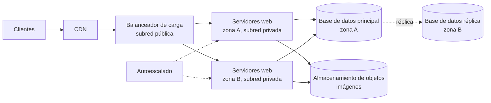

[← Volver al índice](index.md)

# RA2 — Actividades resueltas y guía docente

Soluciones modelo de las siete actividades y de las preguntas de comprobación de la teoría, con las rúbricas y el reparto de evaluación al final; los enunciados que se dan al alumnado están en la pestaña «RA2 · Enunciados». Los precios de nube que aparecen en la práctica 2 son supuestos ilustrativos para mostrar el método, no precios reales: sustitúyelos por los de las calculadoras el día de la práctica.

## Mapa de actividades

| Sesión | Actividad | Min | Formato | Criterios | Cómo cuenta |
| --- | --- | --- | --- | --- | --- |
| 1 | Práctica 1: radiografía de un servidor | 45 | Pareja, terminal | a, e, f | Formativa |
| 2 | Práctica 2: coste a 3 años | 50 | Pareja, hoja de cálculo | b | Trabajo evaluable |
| 3 | Comité de arquitectura | 55 | Pareja, debate | c | Formativa |
| 4 | Investigación guiada | 15 | Pareja, navegador | b, d | Se integra en la práctica 3 |
| 4 | Práctica 3: diagrama | 35 | Pareja, diagrama | d | Trabajo evaluable |
| 5 | Práctica 4: equivalencias y ruta de una petición | 30 | Pareja | e, f | Trabajo evaluable |
| 5 y 6 | Investigación y presentación | 30 + 40 | Pareja | e, f | Trabajo evaluable |
| 6 | Prueba escrita | 50 | Individual | b, d, e, f | Examen |

**Reglas comunes.**

- Cinco parejas fijas durante todo el RA (si el grupo es impar, un trío); las parejas se forman en la sesión 1 y no cambian.
- Todo se hace y se entrega en clase: cada actividad se sube a Aules en los últimos 10 min de la sesión. No hay tarea para casa.
- Ninguna actividad necesita cuenta en AWS o Azure ni el servidor Proxmox: solo terminal, navegador, LibreOffice y diagrams.net (que funciona sin registro y guarda en local).
- Antes de la sesión 1 comprueba desde la red del centro que abren las calculadoras de precios de AWS y de Azure, diagrams.net y las páginas públicas de infraestructura global de ambos proveedores.
- Los datos de escenario están inventados y marcados como tales; los precios de nube los aporta cada calculadora el día de la práctica.

## Práctica 1 resuelta · Radiografía de un servidor

**Ficha de ejemplo** con un portátil típico; los valores de cada equipo variarán, pero la traducción a la nube es la misma.

| Recurso | Valor de ejemplo | Cómo se llama en la nube |
| --- | --- | --- |
| Núcleos e hilos | 4 núcleos, 2 hilos por núcleo, 8 hilos en total | 8 vCPU |
| Memoria RAM | 16 GiB | Memoria de la instancia |
| Disco | 512 GB NVMe con ROTA 0 (SSD) | Volumen de bloque SSD: EBS en AWS, Managed Disk en Azure |
| Interfaz de red e IP | wlp2s0 con 192.168.1.35/24 | Interfaz de red virtual con IP privada en una subred de una VPC o VNet |
| Puerta de enlace | default via 192.168.1.1 | Puerta de enlace a Internet o NAT |
| ¿Está virtualizado? | none: se ejecuta directamente sobre el hardware | El nombre del hipervisor o plataforma (por ejemplo, microsoft en Azure y kvm o amazon en AWS, según la versión de systemd) |

**Tamaño equivalente.** Para 8 vCPU y 16 GiB: c5.2xlarge en AWS (8 vCPU, 16 GiB) y Standard\_F8s\_v2 en Azure (8 vCPU, 16 GiB). Si el equipo tiene 32 GiB, valen m5.2xlarge y Standard\_D8s\_v5. Los nombres de tamaños cambian con el tiempo: contrástalos con la documentación oficial.

**Respuestas modelo**

1. El servicio se detiene hasta reparar o sustituir el disco, y sin copias ni RAID se pierden los datos: es un punto único de fallo. En la nube el disco es un volumen virtual replicado dentro de la zona y puede reconectarse a otra instancia.
2. Alimentación redundante (SAI y grupo electrógeno), refrigeración, red redundante, control de acceso físico y extinción de incendios, entre otros. En la nube los opera el proveedor.
3. En el portátil devuelve none porque el sistema corre directamente sobre el hardware. En una instancia devolvería el nombre del hipervisor o de la plataforma, porque la máquina es virtual y comparte servidor físico con otras.

**Qué mirar al corregir.** Que traduzcan hilos a vCPU, que distingan disco de bloque de otros tipos de almacenamiento y que la respuesta 2 nombre elementos de infraestructura física y no solo servidores.

## Práctica 2 resuelta · Coste a 3 años, on-premise frente a nube

### Opción A · Servidor propio (cálculo exacto con los datos del enunciado)

| Concepto | Cálculo | Total en 3 años |
| --- | --- | --- |
| Compra inicial | 3.200 + 500 + 200 | 3.900,00 € |
| Electricidad y refrigeración | 0,25 kW × 730 h × 0,20 €/kWh × 1,3 = 47,45 €/mes, por 36 meses | 1.708,20 € |
| Internet profesional | 60 €/mes por 36 meses | 2.160,00 € |
| Copias remotas | 20 €/mes por 36 meses | 720,00 € |
| Garantía y mantenimiento | 10 % de 3.700 € (servidor y SAI), por 3 años | 1.110,00 € |
| Administración | 10 % de 36.000 € al año, por 3 años | 10.800,00 € |
| **Total** |  | **20.398,20 €** |

Si la pareja incluye también el disco externo en la base del mantenimiento, el total sube 60 €; vale mientras lo explique. El equivalente mensual es de unos 566,62 €.

### Opción B · Nube, con precios supuestos

Atención: estos precios unitarios están **inventados para ilustrar el método**. En clase, el alumnado usa los que devuelva cada calculadora.

| Supuesto ilustrativo | Valor |
| --- | --- |
| Máquina virtual 2 vCPU y 8 GB, bajo demanda | 0,085 €/h |
| La misma con compromiso a 1 año | 0,055 €/h |
| La misma con compromiso a 3 años | 0,037 €/h |
| Disco SSD | 0,09 €/GB al mes |
| Tráfico saliente | primeros 100 GB gratis; después 0,085 €/GB |
| Copias (instantáneas) | 0,05 €/GB al mes |

Coste mensual de infraestructura: máquina (730 h) más disco de 200 GB (18 €), más 900 GB de tráfico facturable (76,50 €), más 200 GB de copias (10 €). A eso se suma la administración, el 5 % de 36.000 € al año (150 €/mes, 5.400 € en 3 años).

| Modalidad | Máquina al mes | Infraestructura al mes | Total en 3 años con administración | Equivalente mensual |
| --- | --- | --- | --- | --- |
| Bajo demanda | 62,05 € | 166,55 € | 11.395,80 € | 316,55 € |
| Compromiso a 1 año | 40,15 € | 144,65 € | 10.607,40 € | 294,65 € |
| Compromiso a 3 años | 27,01 € | 131,51 € | 10.134,36 € | 281,51 € |

Con estos supuestos la opción B queda por debajo de la A desde el primer mes, porque no hay compra inicial y la administración pesa menos; **no hay punto de equilibrio**. Con precios reales el resultado puede cambiar, y por eso conviene que la pareja compruebe cuánto pesa cada componente.

### Análisis «y si…» con estos supuestos

- **Apagar fuera de horario (220 h al mes):** la máquina en nube cuesta 18,70 € al mes en vez de 62,05 €; ahorro de 43,35 € al mes y 1.560,60 € en 3 años (bajo demanda pasa a 9.835,20 €). Un servidor propio apenas ahorra: lo fijo sigue igual y solo se recorta parte de la electricidad, unos 33 € al mes como máximo.
- **Campaña con demanda triplicada durante dos meses:** en la nube se añaden dos máquinas (124,10 € al mes) y el tráfico sube a 3 TB (246,50 € en vez de 76,50 €, es decir, 170 € más); son unos 294 € extra al mes, 588,20 € en total. En propio el servidor no aguanta el triple: hay que comprar otro (unos 3.200 €) o degradar el servicio.
- **Electricidad un 50 % más cara:** en propio sube de 47,45 a 71,18 € al mes, 854,10 € más en 3 años (total 21.252,30 €); en la nube el precio de lista no cambia.

### Conclusiones modelo (cinco líneas)

Recomendamos la nube porque la carga es pequeña y el coste de personal y de compra inicial pesa más que el alquiler. La opción propia solo compensaría si el hardware se reutilizara más de tres años y la administración fuese casi nula. El compromiso a 3 años abarata, pero fija el gasto. No hemos incluido el valor residual del servidor, el IVA, los riesgos de dependencia del proveedor ni el cumplimiento normativo de los datos. Si la carga creciera, la nube escala con el coste y el servidor propio exigiría una compra nueva.

**Qué mirar al corregir.** Que calculen bien la electricidad con el factor de refrigeración, que distingan compra inicial de costes recurrentes, que el gráfico sea acumulado mes a mes y que las conclusiones nombren qué no ha entrado en el cálculo.

## Investigación guiada resuelta · ¿Dónde viven mis datos?

Respuesta modelo para un centro situado en España peninsular; si el centro estuviera en otro país, cambia la fila de la región más cercana.

| Dato | AWS | Azure |
| --- | --- | --- |
| Región más cercana | Europe (Spain), código eu-south-2, en Aragón | Spain Central, en Madrid |
| País | España | España |
| Zonas de disponibilidad | 3 | Sí, 3 según el mapa de regiones consultado |

Las fuentes consultadas para esta tabla son el [anuncio oficial de la región de AWS en España](https://aws.amazon.com/blogs/aws/now-open-aws-region-in-spain) y la [ficha de Spain Central en azurespeed.com](https://www.azurespeed.com/Information/AzureRegions/SpainCentral), una página de terceros. Comprobad ambas contra las páginas oficiales de infraestructura global el día de la práctica, porque las regiones y sus zonas cambian.

**Latencias medidas.** Los valores dependen de la red del centro y del momento, pero el orden de magnitud esperable es este:

| Región | Latencia orientativa |
| --- | --- |
| La más cercana (España) | por debajo de 30 ms |
| Una de Estados Unidos (este) | entre 80 y 120 ms |
| Una de Asia-Pacífico | entre 170 y 300 ms según la región |

**Frase modelo.** «Elegimos la región de España por su baja latencia con nuestros usuarios y porque los datos personales de los clientes permanecen en España y en la UE; otra región europea podría tener más servicios o precios distintos, así que comprobaríamos ambos en la calculadora».

**Qué mirar al corregir.** Que no afirmen que una región es un único centro de datos, que la decisión pese al menos dos factores además de la latencia (precio, servicios disponibles, normativa) y que dejen registrada la fuente de cada dato.

## Comité de arquitectura resuelto

Matrices modelo para los cinco casos. No hay una única respuesta correcta: lo que se evalúa es que los pesos respondan al caso y que la recomendación siga la matriz. Cada celda de opción es la puntuación de 1 a 5; el total es la suma de peso × puntuación.

### Caso 1 · Startup de reparto: nube

| Criterio | Peso | On-premise | Nube |
| --- | --- | --- | --- |
| Inversión inicial | 5 | 1 | 5 |
| Coste a cinco años | 2 | 3 | 3 |
| Variabilidad de la carga | 5 | 1 | 5 |
| Requisitos legales y de datos | 2 | 4 | 3 |
| Latencia y conectividad | 2 | 3 | 4 |
| Capacidades del equipo | 4 | 1 | 3 |
| Riesgo de dependencia del proveedor | 2 | 5 | 2 |
| Tiempo de puesta en marcha | 4 | 1 | 5 |
| **Total ponderado** |  | **48** | **106** |

Recomendación: nube. Con poco capital, demanda incierta y sin administrador de sistemas, pesan más la inversión inicial, la variabilidad y la rapidez que la dependencia del proveedor.

### Caso 2 · Hospital público regional: propio para la historia clínica

| Criterio | Peso | On-premise | Nube |
| --- | --- | --- | --- |
| Inversión inicial | 2 | 4 | 5 |
| Coste a cinco años | 3 | 4 | 3 |
| Variabilidad de la carga | 1 | 4 | 3 |
| Requisitos legales y de datos | 5 | 5 | 2 |
| Latencia y conectividad | 4 | 5 | 3 |
| Capacidades del equipo | 3 | 4 | 2 |
| Riesgo de dependencia del proveedor | 3 | 5 | 2 |
| Tiempo de puesta en marcha | 1 | 3 | 4 |
| **Total ponderado** |  | **99** | **60** |

Recomendación: mantener en propio la historia clínica y los sistemas 24/7, por los datos de salud, la continuidad y el hardware amortizado. Se puede plantear la nube para copias de seguridad cifradas o para entornos de prueba con datos anonimizados.

### Caso 3 · Tienda online con campañas: nube

| Criterio | Peso | On-premise | Nube |
| --- | --- | --- | --- |
| Inversión inicial | 3 | 2 | 5 |
| Coste a cinco años | 3 | 2 | 4 |
| Variabilidad de la carga | 5 | 1 | 5 |
| Requisitos legales y de datos | 2 | 4 | 4 |
| Latencia y conectividad | 3 | 3 | 5 |
| Capacidades del equipo | 2 | 3 | 3 |
| Riesgo de dependencia del proveedor | 2 | 5 | 2 |
| Tiempo de puesta en marcha | 3 | 2 | 5 |
| **Total ponderado** |  | **56** | **100** |

Recomendación: nube con autoescalado. Comprar hardware para un pico que se da dos veces al año dejaría la capacidad ociosa el resto del tiempo.

### Caso 4 · Ayuntamiento mediano: resultado ajustado

| Criterio | Peso | On-premise | Nube |
| --- | --- | --- | --- |
| Inversión inicial | 3 | 2 | 4 |
| Coste a cinco años | 3 | 3 | 3 |
| Variabilidad de la carga | 2 | 3 | 4 |
| Requisitos legales y de datos | 5 | 4 | 3 |
| Latencia y conectividad | 2 | 4 | 4 |
| Capacidades del equipo | 4 | 2 | 3 |
| Riesgo de dependencia del proveedor | 3 | 4 | 2 |
| Tiempo de puesta en marcha | 2 | 2 | 4 |
| **Total ponderado** |  | **73** | **78** |

Recomendación: nube en una región de la UE con servicios que acrediten conformidad con el Esquema Nacional de Seguridad, pero el resultado está muy ajustado y depende del peso que se dé a los requisitos legales y a la falta de personal. Es un buen caso para el debate: si la puntuación de la nube en requisitos legales bajara de 3 a 2, la nube sumaría 73 y empataría con la opción propia.

### Caso 5 · Fábrica con líneas de producción: propio para el control, nube para el análisis

| Criterio | Peso | On-premise | Nube |
| --- | --- | --- | --- |
| Inversión inicial | 2 | 3 | 4 |
| Coste a cinco años | 2 | 4 | 3 |
| Variabilidad de la carga | 1 | 4 | 3 |
| Requisitos legales y de datos | 3 | 4 | 3 |
| Latencia y conectividad | 5 | 5 | 1 |
| Capacidades del equipo | 3 | 4 | 2 |
| Riesgo de dependencia del proveedor | 2 | 4 | 2 |
| Tiempo de puesta en marcha | 1 | 3 | 4 |
| **Total ponderado** |  | **78** | **45** |

Recomendación: el control de planta se queda en propio, porque no puede depender de Internet. Los datos de sensores, que se analizan en diferido, pueden enviarse a la nube para su análisis, algo que anticipa el modelo híbrido del RA3.

**Qué mirar al corregir.** Que los pesos varíen de un caso a otro, que la recomendación cite los dos o tres criterios con más peso y que en las objeciones del abogado del diablo se discuta un peso o una puntuación concretos, no una opinión general.

## Práctica 3 resuelta · Diagrama de infraestructura y arquitectura

Solución modelo para el caso 3, la tienda online con campañas, en una región de la UE con dos zonas de disponibilidad. El alumnado dibujará algo equivalente con los iconos de AWS o de Azure en diagrams.net.

El dibujo se lee de izquierda a derecha: el tráfico entra por la CDN y el balanceador, se reparte entre servidores en dos zonas, y los datos están en una base de datos replicada y en almacenamiento de objetos; el autoescalado ajusta el número de servidores.

**Tabla de clasificación modelo**

| Elemento o decisión | Infraestructura (I) o arquitectura (A) | Justificación | Qué exigiría en on-premise |
| --- | --- | --- | --- |
| Máquinas virtuales de la capa web | I | Recursos de cómputo que se alquilan | Servidores físicos, hipervisor y su mantenimiento |
| 1. Repartir los servidores web entre dos zonas | A | Decisión de diseño para resistir la caída de una zona | Un segundo centro de datos o una sala aislada |
| Balanceador de carga | I | Recurso de red gestionado | Un equipo dedicado o un programa como HAProxy con su administración |
| 2. Autoescalado por demanda | A | Decide cómo crece y decrece la capacidad en campañas | Comprar servidores para el pico y dejarlos ociosos el resto del año |
| Base de datos principal | I | Recurso de datos | Servidor de base de datos, licencias y copias |
| 3. Réplica en la otra zona | A | Decisión de resiliencia de los datos | Segundo servidor y enlace de replicación |
| Red virtual (VPC o VNet) | I | Red privada aislada del cliente | Conmutadores, VLAN y cortafuegos propios |
| 4. Servidores y base de datos en subredes privadas | A | Decisión de seguridad: nada expuesto directamente a Internet | Segmentación por VLAN y reglas de cortafuegos |
| Almacenamiento de objetos | I | Recurso de almacenamiento casi ilimitado | NAS o sistema de objetos propio |
| 5. Imágenes fuera de los servidores | A | Los servidores quedan sin estado y se pueden crear y destruir libremente | Almacenamiento compartido en red |
| 6. Región de la UE | A | Latencia baja y datos de clientes dentro de la UE | Ubicación física del centro de datos |

**Errores frecuentes.**

- Llamar decisión de arquitectura a un recurso («la base de datos») en vez de a la elección sobre él («réplica en otra zona»).
- Confundir zonas de disponibilidad con regiones, o dibujar dos regiones sin justificarlo.
- Colocar la base de datos en la subred pública.
- Dibujar un balanceador delante de un solo servidor, o dos servidores en la misma zona.
- No poder decir qué exigiría cada elemento en on-premise.

**Qué mirar al corregir.** Los cuatro requisitos mínimos del diagrama, la coherencia entre el dibujo y la tabla, y que las decisiones numeradas se puedan justificar con un requisito del caso (disponibilidad, picos, seguridad o normativa).

## Práctica 4 resuelta · Equivalencias y ruta de una petición

### Parte 1 · Del centro de datos propio a la nube

| Elemento de un centro de datos propio | Equivalente en AWS y en Azure | ¿Quién lo opera? |
| --- | --- | --- |
| SAI y grupo electrógeno | Energía redundante del centro de datos y de cada zona de disponibilidad | Proveedor |
| Rack con servidor físico | Instancia EC2 o máquina virtual; también instancias de servidor dedicado | Proveedor el hardware, cliente la configuración |
| Discos SAN de las máquinas virtuales | EBS o Managed Disks | Proveedor opera; el cliente decide tamaño, tipo, cifrado y copias |
| NAS con carpetas compartidas | EFS o FSx, o Azure Files | Ambos |
| Cortafuegos perimetral y sus reglas | Grupos de seguridad o NSG, y servicios de cortafuegos gestionado | Cliente configura las reglas |
| VLAN para separar redes | Subredes de una VPC o VNet | Cliente |
| Servidor DNS | Route 53 o Azure DNS | Proveedor opera el servicio; el cliente define los registros |
| Hipervisor (Proxmox, ESXi) | Hipervisor del proveedor (Nitro, Hyper-V), invisible para el cliente | Proveedor |
| Discos o cintas de copias de seguridad | Instantáneas, AWS Backup o Azure Backup y almacenamiento de objetos | Ambos: el cliente define la política |
| Ticket a sistemas para pedir un servidor | Autoservicio por consola, CLI o API | Cliente |

### Parte 2 · Ruta de una petición

| Orden | Paso | Componente que actúa | Característica NIST |
| --- | --- | --- | --- |
| 1 | C. La persona pide la máquina | Consola, CLI o API del plano de control | Autoservicio bajo demanda y acceso amplio por red |
| 2 | E. Se comprueban identidad, permiso y cuota | Plano de control con gestión de identidades | Ninguna en concreto |
| 3 | B. Se elige un servidor físico con capacidad | Plano de control sobre el inventario de servidores | Agrupación de recursos |
| 4 | D. El hipervisor crea la máquina virtual | Hipervisor en el servidor físico elegido | Agrupación de recursos (varios clientes, un servidor) |
| 5 | G. Se copia la imagen al disco virtual | Almacenamiento | Ninguna en concreto |
| 6 | H. Se conecta a la red virtual y se asigna IP | Red virtual | Ninguna en concreto |
| 7 | F. La máquina arranca y queda en ejecución | Hipervisor y servidor físico | Elasticidad rápida: el recurso está listo en minutos |
| 8 | A. Empieza a contarse el uso | Sistema de medición y facturación | Servicio medido |

**Respuestas a las preguntas finales**

1. Lo decide el plano de control en el paso B. El cliente elige región y zona, pero no el servidor físico, porque los recursos están agrupados y compartidos entre clientes (agrupación de recursos) y el proveedor los reasigna según la capacidad libre.
2. En D se aprovisiona la CPU y la RAM virtuales, en G el disco y en H la red y la IP. Para implementar la carga falta instalar y configurar la aplicación y sus dependencias, cargar los datos y arrancar el servicio, a mano, con guiones de arranque, con contenedores o con infraestructura como código.

**Qué mirar al corregir.** Que el orden sea C, E, B, D, G, H, F, A (se puede aceptar G y H intercambiados si lo justifican), que no confundan quién opera con quién configura, y que separen aprovisionar de implementar.

## Presentaciones resueltas · Guion modelo por tema

Esquema de referencia para valorar cada exposición, siguiendo las seis diapositivas del enunciado. El dato verificable lo busca cada pareja con fuente y fecha; aquí se indica qué debería aparecer.

### Tema 1 · Un centro de datos por dentro

- **Frase:** un centro de datos es un edificio preparado para alimentar, refrigerar, proteger y conectar servidores de forma continua.
- **Dibujo:** cadena de energía (acometida, SAI, grupo electrógeno), refrigeración con pasillos fríos y calientes, red, racks y seguridad física.
- **Equivalencias:** on-premise es una sala propia o housing; en AWS y Azure, el centro de datos está dentro de una zona de disponibilidad.
- **Dato verificable:** nivel Tier o PUE publicado por un proveedor o por un centro de datos real, con su fuente.
- **Pregunta para la clase:** ¿por qué una empresa pequeña difícilmente alcanza en su sala la redundancia de un centro de datos de nivel alto?

### Tema 2 · Virtualización e hipervisores

- **Frase:** un hipervisor reparte un servidor físico entre varias máquinas virtuales aisladas.
- **Dibujo:** servidor físico, hipervisor y tres máquinas virtuales; al lado, contenedores compartiendo el núcleo del sistema.
- **Equivalencias:** Proxmox usa KVM; AWS usa Nitro, basado en KVM; Azure usa Hyper-V.
- **Dato verificable:** hipervisor que declara cada proveedor en su documentación oficial.
- **Pregunta para la clase:** ¿qué ventaja de aislamiento tiene una máquina virtual sobre un contenedor y qué coste tiene?

### Tema 3 · La red de la nube

- **Frase:** una VPC o VNet es una red privada, aislada y definida por software dentro de la red del proveedor.
- **Dibujo:** red con subredes pública y privada, tabla de rutas, puerta de enlace a Internet, NAT y reglas de seguridad.
- **Equivalencias:** VLAN y cortafuegos propios, grupos de seguridad en AWS, NSG en Azure.
- **Dato verificable:** rangos de direcciones y límites documentados por el proveedor, con enlace.
- **Pregunta para la clase:** ¿qué pasaría si la base de datos estuviera en una subred pública?

### Tema 4 · El almacenamiento

- **Frase:** la nube ofrece tres tipos de almacenamiento (bloque, archivos y objetos), cada uno para un uso distinto.
- **Dibujo:** tres cajas con un ejemplo de uso y su servicio equivalente en propio, AWS y Azure.
- **Equivalencias:** SAN, NAS y almacenamiento de objetos propio; EBS, EFS y S3; Managed Disks, Azure Files y Blob Storage.
- **Dato verificable:** durabilidad declarada de un servicio y sus niveles de acceso, con fuente.
- **Pregunta para la clase:** ¿por qué guardar las copias en la misma zona no protege de la caída de la zona?

### Tema 5 · Cómo gana dinero la nube

- **Frase:** el proveedor gana alquilando la misma capacidad a muchos clientes y cobrando por uso medido.
- **Dibujo:** flujo desde el uso (horas, GB, tráfico) hasta la factura, con las economías de escala como base.
- **Equivalencias:** compra inicial frente a pago por uso; tres modalidades de compra en AWS y en Azure.
- **Dato verificable:** precio de lista de una máquina virtual en tres modalidades, con la fecha de consulta.
- **Pregunta para la clase:** ¿por qué a menudo es gratis meter datos en la nube y cuesta sacarlos?

**Qué mirar al corregir.** Contenido técnico correcto, dibujo propio que explique algo, equivalencias sin errores, fuentes fiables y una pregunta que obligue a razonar. Se aplica la rúbrica de la presentación de la sección de evaluación.

## Soluciones de las preguntas de comprobación

Respuestas modelo a las preguntas con las que termina cada sesión en la pestaña de teoría.

### Sesión 1

1. Una aplicación es lo que usa la persona (una tienda online); su infraestructura son los servidores, la red y los discos donde se ejecuta.
2. SAI, refrigeración, control de acceso físico, extinción de incendios, cableado o conmutadores, entre otros.
3. Autoservicio bajo demanda.
4. Ambas cosas: es una nube privada on-premise.
5. Porque lo que define a la nube es cómo se obtienen y se pagan los recursos (autoservicio, medición, elasticidad) y no dónde están los servidores.

### Sesión 2

1. Primero interviene la autenticación; después el plano de control, el hipervisor y, en paralelo con el plano de control, la medición del uso.
2. Una región es un área geográfica con varios centros de datos; una zona de disponibilidad es uno o varios centros de datos aislados dentro de una región. Protege de la caída de un centro de datos la zona, no la región.
3. Los picos de unos clientes se compensan con los valles de otros, así el hardware se aprovecha más y se vende la misma capacidad a más clientes.
4. Por flexibilidad: sin compromiso se puede apagar o cambiar de tamaño; si no se sabe cuánto tiempo se va a usar, el descuento por compromiso no compensa.
5. El proveedor responde de la seguridad de la nube (centros de datos, hardware, virtualización); la empresa, de la seguridad en la nube (datos, identidades, accesos y configuración).

### Sesión 3

1. Escalabilidad es poder crecer, en vertical o en horizontal; elasticidad es ajustar la capacidad automáticamente hacia arriba y hacia abajo. Ejemplo: una tienda que vende diez veces más el Black Friday.
2. Porque el hardware ya está amortizado y se usa a plena capacidad todo el tiempo, así que el precio por uso incluye un margen que no compensa.
3. Por ejemplo: costes variables imprevistos, dependencia del proveedor, transferencias de datos fuera de la UE o caídas ajenas.
4. El RGPD (datos personales y transferencias internacionales) y el Esquema Nacional de Seguridad.
5. 3 × 4 + 2 × 5 + 5 × 1 = 27.

### Sesión 4

1 I · 2 A · 3 I · 4 A · 5 I · 6 A. La justificación es que 1, 3 y 5 son recursos que existen (máquina, disco, centro de datos) y 2, 4 y 6 son decisiones sobre cómo combinarlos.

### Sesión 5

1. El de tipo 1 se ejecuta directamente sobre el hardware (ESXi, KVM, Hyper-V, Xen); el de tipo 2, sobre un sistema operativo de escritorio (VirtualBox, VMware Workstation).
2. Aprovisionar es crear los recursos virtuales (máquina, disco, red); implementar la carga es poner la aplicación a funcionar sobre ellos.
3. Las imágenes, en almacenamiento de objetos (barato, escala y se sirve por HTTP); el disco de la base de datos, en almacenamiento de bloque (baja latencia).
4. Una VPC es una red privada virtual aislada para cada cliente, definida por software; resuelve el aislamiento y el control del direccionamiento sobre una infraestructura compartida.
5. Si falla el centro de datos, pierde los datos y las copias a la vez; hay que guardar copias en otra zona, otra región o en otro medio.

## Evaluación: rúbricas y reparto entre criterios

Los trabajos y la prueba escrita evidencian los criterios b, d, e y f en el centro; los criterios a y c se evidencian con el informe de FE, y en clase solo se trabajan de forma formativa.

| Instrumento | Tipo | Criterios | Evidencia |
| --- | --- | --- | --- |
| Práctica 2 | Trabajo | b | Hoja de cálculo, gráfico y conclusiones |
| Práctica 3 | Trabajo | d, con apoyo de e y f | Diagrama y tabla de clasificación |
| Práctica 4 | Trabajo | e, f | Tabla de equivalencias y ruta ordenada |
| Presentación | Trabajo | e, f (b en el tema 5) | PDF y exposición oral |
| Prueba escrita | Examen | b, d, e, f | Prueba individual de 50 min |
| Práctica 1 y Comité | Formativas | a, c, e, f | Retroalimentación sin nota |
| Informe de FE | Empresa | a, c | Fuera de este documento |

**Propuesta de reparto** dentro de la parte evaluada en el centro, con el 60 % examen y 40 % trabajos que fija el PCC para la primera evaluación (ajústalo si prefieres otro): prueba escrita 60; Práctica 2, 10; Práctica 3, 10; Práctica 4, 8; presentación, 12.

### Rúbrica común para las prácticas 2, 3 y 4 (0 a 8 puntos)

| Aspecto | Logrado (2) | En progreso (1) | No logrado (0) |
| --- | --- | --- | --- |
| Corrección técnica | Cálculos, clasificaciones y equivalencias correctos | Errores puntuales que no cambian el resultado | Errores que invalidan las conclusiones |
| Justificación | Cada decisión o conclusión se apoya en un criterio explícito | Justifica solo una parte | No justifica |
| Vocabulario | Usa los términos del RA con precisión | Mezcla o usa mal algún término | Confunde conceptos básicos |
| Entrega | Completa, ordenada y en plazo | Falta una parte menor | Incompleta o fuera de plazo |

### Rúbrica de la presentación (0 a 10 puntos)

| Aspecto | Logrado (2) | En progreso (1) | No logrado (0) |
| --- | --- | --- | --- |
| Contenido técnico | Correcto, con el nivel del RA | Correcto pero superficial o con algún error | Incorrecto o ausente |
| Explicación propia | El dibujo es de la pareja y aclara cómo funciona | Dibujo copiado o poco explicativo | Sin dibujo |
| Equivalencias | Relaciona on-premise, AWS y Azure sin errores | Equivalencias parciales | No las incluye |
| Fuentes y dato verificable | Al menos dos fuentes fiables y un dato contrastado | Fuentes débiles o sin dato | Sin fuentes |
| Exposición y preguntas | Ambas personas hablan, sin leer, y responden con seguridad | Una persona lleva casi todo, o lee | No se sostiene la exposición |

### Prueba escrita de la sesión 6 (50 min, estructura sugerida)

- 12 preguntas tipo test, tres por criterio (b, d, e, f), con las preguntas de comprobación de cada sesión como banco de partida.
- 3 preguntas cortas: una de modelo de negocio (b), una de componentes (e, f) y una de infraestructura frente a arquitectura (d).
- 1 mini caso: dado un diagrama sencillo, clasificar cinco elementos como infraestructura o decisión de arquitectura y proponer una mejora de disponibilidad.

Pendiente: la plantilla del informe de FE para los criterios a y c, que puede derivarse de las sesiones 1 y 3.

---
[← Enunciados](RA2-enunciados.md) · [Volver al índice](index.md)
