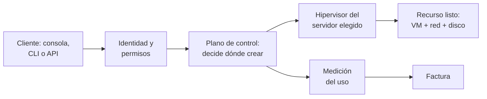
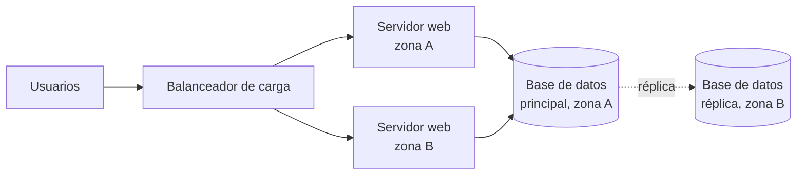

[← Volver al índice](index.md)

# RA2 — Infraestructura TI: on-premise frente a nube

2026-09-21 · @Someone

El RA2 se cubre en 12 h (seis sesiones de 2 h): esta pestaña trae la teoría sesión a sesión y las pestañas «RA2 · Enunciados» y «RA2 · Actividades resueltas» las actividades para el alumnado y sus soluciones. Está pensado para portátiles con Ubuntu MATE, parejas de trabajo (grupo de hasta 10), unos 100 min útiles por sesión, nada para casa, y sin depender de Proxmox ni de cuentas cloud; los ejemplos van en AWS y Azure en paralelo para que valga la plataforma que elijas.

## Plan de sesiones

Cada sesión de 2 h se reparte en unos 100 min útiles: 10 de arranque y repaso, 35-40 de teoría, 35-45 de actividad y 10 de cierre y entrega en Aules.

| Sesión | Criterios | Teoría | Actividad (en clase) |
| --- | --- | --- | --- |
| 1 | a | Infraestructura TI, on-premise y nube; definición NIST | Práctica 1: radiografía de un servidor con el portátil |
| 2 | b | Cómo funciona la nube y cómo gana dinero | Práctica 2: coste a 3 años, on-premise frente a nube |
| 3 | c | Beneficios, riesgos y cuándo NO usar la nube | Comité de arquitectura: debate con casos de empresa |
| 4 | d | Infraestructura frente a arquitectura de nube | Investigación guiada (regiones y latencia) + Práctica 3: diagrama |
| 5 | e, f | Servidores, redes, almacenamiento y software | Práctica 4: equivalencias y ruta de una petición + preparar presentaciones |
| 6 | a-f | Repaso | Presentaciones por parejas (40 min) + prueba escrita (50 min) |

## Sesión 1 · Qué es la infraestructura TI: on-premise frente a nube (criterio a)

La infraestructura TI es el conjunto de recursos físicos y lógicos necesarios para ejecutar aplicaciones, y la gran decisión es dónde vive: en instalaciones propias (on-premise) o en la nube, donde se consume como un servicio. El criterio a pide definir la nube y diferenciarla de lo propio; hoy se fija el vocabulario que usará todo el RA.

**Guion de tiempos (40 min):** 10 min infraestructura TI y on-premise · 20 min nube y sus cinco características · 10 min tabla comparativa y cierre. Arranque de sesión (10 min): «¿Dónde están hoy vuestro correo, vuestras fotos y vuestras series? ¿Cuáles de esas cosas están "en la nube" y cuáles en un servidor de alguien?».

### 1. Infraestructura frente a aplicación

Una aplicación (una tienda online, un ERP) es lo que usa la persona; la infraestructura es lo que la hace funcionar. Se compone de:

- **Hardware:** servidores, almacenamiento, equipos de red, y los equipos de energía y refrigeración que los sostienen.
- **Software de base:** sistema operativo, virtualización, herramientas de gestión y monitorización.
- **Servicios de red y seguridad:** direccionamiento, DNS, cortafuegos, accesos.
- **El emplazamiento físico:** desde una sala de servidores hasta un centro de proceso de datos (CPD).

### 2. Infraestructura on-premise (instalaciones propias)

La organización compra o alquila el hardware y lo opera en sus propias instalaciones. Es responsable de todo: adquisición, instalación, energía, refrigeración, seguridad física, redundancia, mantenimiento, actualizaciones y personal. El servidor Proxmox del instituto es un ejemplo cercano de infraestructura propia.

Rasgos que la definen:

- **Propiedad y operación:** el hardware es de la organización (o está dedicado a ella) y lo administra su personal.
- **Modelo económico:** inversión inicial grande (CAPEX: compra de equipos) más costes de operación (OPEX: energía, personal, mantenimiento).
- **Dimensionado para el pico:** se compra pensando en la demanda máxima prevista, con ciclos de renovación de 3 a 5 años.
- **Variantes cercanas:** en el *housing* o *colocation* el hardware es propio pero está en el CPD de un tercero; en el hosting dedicado el hardware es del proveedor pero de uso exclusivo. En sentido estricto, on-premise es lo que se opera dentro de las instalaciones de la organización.

**Anatomía de un CPD.** Además de los racks (armarios con unidades «U» de altura) hay: acometida eléctrica, SAI (baterías) y grupo electrógeno; refrigeración con pasillos fríos y calientes; control de acceso y extinción de incendios; cableado estructurado, conmutadores y cortafuegos. El estándar de referencia habitual clasifica los CPD en niveles Tier I a IV según su redundancia, con disponibilidades orientativas de 99,671 %, 99,741 %, 99,982 % y 99,995 % (Uptime Institute). Para medir la eficiencia energética se usa el PUE: energía total del CPD dividida entre la energía que consumen solo los equipos informáticos; 1,0 sería el ideal y cuanto más cerca, mejor.

### 3. Infraestructura de nube

La definición de referencia es la del NIST ([SP 800-145](https://csrc.nist.gov/publications/detail/sp/800-145/final), 2011): la computación en la nube es un modelo que da acceso por red, cómodo y bajo demanda, a un conjunto compartido de recursos configurables (redes, servidores, almacenamiento, aplicaciones, servicios) que se aprovisionan y liberan rápido con mínimo esfuerzo de gestión o contacto con el proveedor. Lo importante para el aula: **la nube es un modelo de consumo, no un lugar.**

El NIST enumera cinco características esenciales:

| Característica | Qué significa | Cómo se ve en la práctica |
| --- | --- | --- |
| Autoservicio bajo demanda | El cliente crea y elimina recursos sin hablar con nadie | Lanzar una máquina virtual desde el navegador o la API en minutos |
| Acceso amplio por red | Los servicios se usan por red con mecanismos estándar y desde cualquier dispositivo | Consola web, línea de comandos y API |
| Agrupación de recursos | Los recursos del proveedor se comparten entre muchos clientes (multiinquilino) y se asignan de forma dinámica | El cliente elige región o zona, no el servidor físico concreto |
| Elasticidad rápida | Los recursos crecen o se reducen según la demanda, a menudo de forma automática | Para el cliente parecen ilimitados |
| Servicio medido | El uso se mide y se factura; puede monitorizarse | Facturación por hora, por GB o por petición |

### 4. Diferencia esencial

La diferencia no es dónde están los servidores, sino quién los posee y opera y cómo se obtienen y se pagan. Analogía útil: tener tu propio generador eléctrico frente a contratar la red eléctrica y pagar por kWh.

| Aspecto | On-premise | Nube pública |
| --- | --- | --- |
| Propiedad del hardware | La organización | El proveedor |
| Ubicación | Instalaciones propias | Centros de datos del proveedor, en regiones geográficas |
| Quién opera el hardware | Personal propio | El proveedor |
| Cómo se obtiene | Compra, instalación, puesta en marcha (semanas o meses) | Autoservicio (minutos) |
| Cómo se paga | Inversión inicial + costes fijos | Por uso medido |
| Dimensionado | Se calcula de antemano | Se ajusta sobre la marcha |

**Matiz importante:** on-premise no significa «sin nube». Una organización puede montar en sus instalaciones un sistema con autoservicio, agrupación de recursos, elasticidad y facturación por uso; eso es una nube privada on-premise (se estudia en el RA3).

### 5. Contexto histórico (5 min, opcional)

Mainframes y tiempo compartido (años 60-70) → cliente-servidor (años 80-90) → virtualización de servidores x86 (años 2000) → en 2006 Amazon lanza S3 y EC2, el arranque del cloud comercial → Azure sale comercialmente en 2010. Cada paso separa un poco más el recurso de la máquina física.

### Preguntas de comprobación

1. ¿Qué diferencia hay entre una aplicación y su infraestructura? Pon un ejemplo.
2. Nombra tres elementos de un CPD que no sean servidores.
3. Para crear un servidor hay que abrir un ticket y esperar dos semanas: ¿qué característica NIST no se cumple?
4. Una empresa monta en su sala un sistema con autoservicio, elasticidad y cobro interno por uso. ¿Es on-premise o nube? (Ambas: nube privada on-premise.)
5. ¿Por qué se dice que la nube es un modelo de consumo y no un lugar?

## Sesión 2 · Cómo funciona la nube y cómo gana dinero (criterio b)

La nube funciona porque un proveedor invierte en centros de datos enormes con hardware estandarizado, los divide con virtualización y los reparte entre miles de clientes a los que factura solo por lo que usan. El criterio b pide describir ese funcionamiento vinculándolo con el modelo de negocio: las dos mitades se explican a la vez.

**Guion de tiempos (40 min):** 15 min funcionamiento técnico y geografía · 20 min modelo de negocio y formas de pago · 5 min responsabilidad compartida. Arranque (10 min): repaso con las preguntas de comprobación de la sesión 1.

### 1. Qué ocurre cuando pides un recurso

Detrás de un clic hay cuatro piezas: centros de datos con servidores estandarizados, una capa de **virtualización** (hipervisor) que divide cada servidor físico en máquinas virtuales aisladas, un **plano de control** (APIs, planificador, gestión de identidades) que decide qué se crea y dónde, y un sistema de **medición y facturación** que anota el uso.

La ruta se lee de izquierda a derecha y la rama inferior es la que convierte el uso en dinero; esta misma ruta se retoma en la práctica 4.

### 2. Organización geográfica

- **Región:** área geográfica que agrupa varios centros de datos. El cliente elige en qué región viven sus recursos y sus datos, lo que importa para latencia, precio y normativa de protección de datos.
- **Zona de disponibilidad (AZ):** uno o varios centros de datos aislados dentro de una región, con energía y red independientes y conectados entre sí con muy baja latencia. Si una zona cae, las demás siguen funcionando. Azure las ofrece en las regiones que las soportan.
- **Borde (edge):** puntos de presencia cercanos al usuario final, usados sobre todo para servir contenido en caché (CDN).

### 3. El modelo de negocio, pieza a pieza

1. **Economías de escala.** Comprar hardware, energía y refrigeración por volúmenes enormes baja el coste por unidad; algunos proveedores diseñan incluso sus propios procesadores y tarjetas de red (AWS Nitro y Graviton, por ejemplo).
2. **Multiinquilinato.** Los picos de un cliente se compensan con los valles de otro, así que el aprovechamiento medio del hardware es mayor que en un CPD propio, y ese margen es el negocio del proveedor.
3. **Del CAPEX al OPEX.** El proveedor asume la inversión y el cliente paga por uso (*pay-as-you-go*), sin compra inicial.
4. **Qué se factura.** Tiempo de cómputo (por segundo u hora), almacenamiento (GB al mes), tráfico de red (sobre todo el que **sale** de la nube, el *egress*), peticiones u operaciones en servicios gestionados, y soporte.
5. **Formas de comprar el mismo recurso:**
   - Bajo demanda: sin compromiso y el precio de lista más alto.
   - Compromiso de uso a 1 o 3 años (Reserved Instances y Savings Plans en AWS; Reservations y Savings Plans en Azure) a cambio de un descuento.
   - Capacidad sobrante (Spot en AWS, Spot VMs en Azure) con gran descuento, pero el proveedor puede recuperarla con poco aviso.
6. **Servicios gestionados.** El proveedor va más allá de alquilar servidores y vende bases de datos, colas o análisis ya operados, donde el cliente paga por no gestionar.
7. **Retención del cliente.** Los créditos y niveles gratuitos captan clientes y, una vez que los datos y los servicios propios del proveedor están dentro, salir cuesta (dependencia del proveedor y coste de egress); es un riesgo que se retoma en la sesión 3.

**Mini cálculo para la pizarra:** un mes tiene unas 730 horas. Si una máquina virtual cuesta X euros por hora, dejarla encendida todo el mes cuesta 730 × X; apagarla fuera de horario laboral (unas 220 horas al mes, de 10 h × 22 días) baja la cuota a menos de un tercio. Ese es el servicio medido convertido en dinero.

### 4. Responsabilidad compartida y SLA

El proveedor responde de la seguridad **de** la nube (centros de datos, hardware, virtualización); el cliente responde de la seguridad **en** la nube (sus datos, identidades, accesos y configuración). Cuánto le toca a cada uno varía según el tipo de servicio, algo que se detalla en el RA4. El **SLA** es el compromiso de disponibilidad del proveedor (orientativamente entre el 99,9 % y el 99,99 % según la configuración) y su incumplimiento suele compensarse con créditos, no con dinero ni con la recuperación del negocio perdido.

### Preguntas de comprobación

1. Ordena: hipervisor, plano de control, medición del uso, autenticación. ¿Cuál interviene primero?
2. ¿Qué diferencia hay entre región y zona de disponibilidad? ¿Cuál protege de la caída de un centro de datos?
3. Explica con tus palabras por qué el multiinquilinato es rentable para el proveedor.
4. ¿Por qué alguien pagaría más por bajo demanda que por compromiso a 3 años?
5. Tu empresa aloja datos de clientes en la nube: ¿de qué seguridad responde ella y de cuál el proveedor?

## Sesión 3 · Beneficios, riesgos y cuándo no usar la nube (criterio c)

La nube no es mejor por defecto: aporta agilidad, elasticidad y menos inversión inicial, pero introduce costes variables, dependencia del proveedor y obligaciones de cumplimiento, y solo se decide bien comparando ambos modelos con criterios explícitos. Esta sesión prepara el análisis que el alumnado plasmará en el informe de FE, donde está la evidencia evaluable del criterio c.

**Guion de tiempos (35 min):** 15 min beneficios · 10 min límites y riesgos · 10 min cuándo sigue valiendo lo propio y método de decisión. Arranque (10 min): repaso de la sesión 2 con la pregunta «¿cuánto cuesta dejar una máquina encendida un mes?». Después va el Comité de arquitectura (55 min).

### 1. Beneficios frente a on-premise

| Beneficio | Qué aporta | Contraste con lo propio |
| --- | --- | --- |
| Coste | Se pasa de inversión inicial a pago por uso y no se paga capacidad ociosa | En on-premise se compra para el pico y buena parte del año sobra capacidad |
| Elasticidad | La capacidad sube y baja automáticamente con la demanda | Ampliar exige comprar, instalar y esperar |
| Agilidad | Entornos de prueba o producción en minutos; experimentar sale barato | Semanas o meses hasta tener el equipo |
| Disponibilidad | Varias zonas o regiones, copias gestionadas, recuperación ante desastres sin un segundo CPD propio | Replicar un CPD duplica la inversión |
| Alcance global | Desplegar cerca de usuarios de otros países | Requiere presencia física o alquiler de espacio allí |
| Servicios avanzados | Bases de datos, IA, analítica o IoT ya operados | Hay que montarlos y mantenerlos |
| Menos tareas de bajo valor | El equipo deja de comprar racks o cambiar discos y se centra en automatizar y desplegar | El equipo dedica horas a operar hardware |

**Escalabilidad frente a elasticidad.** Escalar es poder crecer: en vertical (más CPU o RAM a un servidor) o en horizontal (más servidores en paralelo). Elasticidad es ajustar esa capacidad automáticamente hacia arriba **y hacia abajo** según la demanda. Ejemplo para la pizarra: una tienda online que vende diez veces más el Black Friday.

**Cuidado con «la nube siempre es más barata».** Una carga estable, predecible y funcionando 24 h durante años, sobre hardware ya amortizado, puede salir más barata en propio. Lo correcto es comparar el **coste total de propiedad (TCO)** a varios años, que es lo que se hace en la práctica 2.

### 2. Límites y riesgos

- **Costes variables e imprevistos:** recursos olvidados encendidos, tráfico de salida, servicios mal dimensionados. Ha nacido una práctica, FinOps, para controlarlo.
- **Dependencia del proveedor (*vendor lock-in*):** cuantos más servicios propietarios se usan, más caro y lento es migrar.
- **Cumplimiento y soberanía del dato:** el RGPD limita las transferencias de datos personales fuera de la UE (la sentencia Schrems II de 2020 anuló el marco anterior con EE. UU. y en 2023 se aprobó otro); el sector público español debe cumplir el Esquema Nacional de Seguridad; y las leyes de terceros países, como la CLOUD Act estadounidense, generan debate sobre el acceso a datos aunque estén en un centro de datos europeo.
- **Conectividad y latencia:** sin Internet no hay acceso, y las cargas que exigen latencia mínima o mueven enormes volúmenes de datos locales pueden encajar mal.
- **Caídas del proveedor:** a veces se cae una zona o una región entera; el cliente no controla la reparación y se protege con arquitectura redundante, que cuesta más.
- **Capacitación y configuración:** una configuración errónea del cliente (un almacenamiento abierto por error, por ejemplo) es una fuente frecuente de brechas de seguridad.

### 3. Cuándo sigue teniendo sentido lo propio

Cargas estables y previsibles a largo plazo con hardware amortizado; datos que por normativa o contrato no pueden salir; latencia extrema o equipos industriales que deben funcionar aunque falle Internet; equipos con la experiencia ya construida. Existen casos públicos de empresas que han repatriado cargas estables desde la nube a infraestructura propia, y muchas organizaciones acaban con un modelo mixto (RA3).

### 4. Método: matriz de decisión ponderada

Cada criterio recibe un peso del 1 al 5 según su importancia para el caso, y cada opción una puntuación del 1 al 5 en ese criterio; se multiplica y se suma. Ejemplo para una startup con lanzamiento incierto:

| Criterio | Peso | On-premise | Nube |
| --- | --- | --- | --- |
| Inversión inicial baja | 5 | 1 | 5 |
| Carga variable | 4 | 2 | 5 |
| Datos sensibles y normativa | 3 | 4 | 3 |
| Experiencia del equipo | 2 | 2 | 3 |
| **Total ponderado** |  | **29** | **60** |

El resultado no sustituye al juicio: sirve para hacer explícitos los criterios y poder discutirlos, que es lo que se practica en el Comité de arquitectura.

### Preguntas de comprobación

1. Diferencia escalabilidad y elasticidad con un ejemplo.
2. ¿Por qué una carga estable 24/7 durante cinco años puede salir más barata en propio?
3. Da dos riesgos de la nube que no existen (o son distintos) en on-premise.
4. Un ayuntamiento quiere alojar padrones de habitantes en la nube: ¿qué dos normas o cuestiones debe mirar antes?
5. Calcula el total ponderado de una opción con pesos 3, 2 y 5 y puntuaciones 4, 5 y 1. (Solución: 3×4 + 2×5 + 5×1 = 27.)

## Sesión 4 · Infraestructura frente a arquitectura de nube (criterio d)

La infraestructura de nube son los recursos que existen (servidores, redes, almacenamiento, virtualización); la arquitectura de nube es el diseño que los combina con servicios para que una aplicación funcione con los requisitos exigidos. Son los ladrillos frente a los planos: con los mismos ladrillos se levantan edificios muy distintos.

**Guion de tiempos (35 min):** 10 min conceptos · 15 min arquitectura de una aplicación web · 10 min requisitos que guían el diseño. Arranque (10 min): repaso de la sesión 3. Después vienen la Investigación guiada (15 min) y la Práctica 3 (35 min).

### 1. Infraestructura de nube

Es el conjunto de recursos de cómputo, red y almacenamiento, junto con la virtualización y el plano de control que los gestiona, sobre los que se ejecutan las cargas de trabajo. Se puede mirar desde dos lados: la infraestructura **del proveedor** (centros de datos, servidores físicos, hipervisores, regiones y zonas) y la infraestructura **del cliente** (las máquinas virtuales, redes virtuales y discos que alquila).

### 2. Arquitectura de nube

Describe cómo se organizan y se conectan los componentes y servicios para lograr un objetivo. Una descripción clásica distingue cuatro partes:

- **Front-end:** lo que usa la persona (navegador, aplicación móvil).
- **Back-end:** servidores, servicios, almacenamiento y aplicaciones que procesan las peticiones.
- **Red y entrega:** Internet, balanceadores, CDN, conexiones privadas.
- **Gestión:** automatización, monitorización y seguridad.

La arquitectura decide, entre otras cosas, cuántos servidores hay, en qué zonas, qué se hace con los datos y cómo se escala. Los estilos habituales son el monolito, las tres capas, los microservicios y la arquitectura sin servidor (esta última se ve en el RA4).

### 3. Arquitectura y ejecución de aplicaciones web

Ejemplo guía para toda la sesión: una tienda online que debe seguir funcionando aunque caiga una zona de disponibilidad.

El dibujo se lee así: las peticiones llegan a un balanceador que las reparte entre dos servidores web en zonas distintas, y ambos hablan con una base de datos que se replica en la otra zona. Cada caja es un **recurso de infraestructura**; el hecho de duplicarlas en dos zonas y repartir el tráfico es **una decisión de arquitectura**.

| Elemento | Recurso de infraestructura (AWS / Azure) | Decisión de arquitectura |
| --- | --- | --- |
| Servidores web | Instancias EC2 / Máquinas virtuales | Cuántas, en qué zonas y con escalado automático |
| Balanceador | Elastic Load Balancing / Azure Load Balancer o Application Gateway | Repartir tráfico y retirar servidores caídos |
| Base de datos | Amazon RDS / Azure SQL Database | Principal más réplica en otra zona |
| Archivos e imágenes | Amazon S3 / Azure Blob Storage | Sacarlos de los servidores para poder crear y destruir estos libremente |
| Red | VPC / Red virtual (VNet) | Subred pública para el balanceador, privadas para servidores y base de datos |

**Dos frases para fijar la diferencia.** Misma infraestructura, arquitecturas distintas: con las mismas tres máquinas virtuales se puede montar un sistema frágil (todo en una máquina) o uno resistente (tres en dos zonas). Misma arquitectura, infraestructuras distintas: el diseño de tres capas puede ejecutarse en un CPD propio o en la nube.

### 4. Qué guía las decisiones de arquitectura

Disponibilidad, escalabilidad, rendimiento, seguridad, coste y facilidad de operación. Los proveedores publican guías para evaluarlas: el **AWS Well-Architected Framework** (seis pilares: excelencia operativa, seguridad, fiabilidad, eficiencia del rendimiento, optimización de costes y sostenibilidad) y el **Azure Well-Architected Framework** (cinco pilares, los mismos salvo la sostenibilidad). Sirven de lista de comprobación al diseñar y son una buena lectura para el alumnado interesado.

En la práctica, la infraestructura acabará descrita como código (infraestructura como código, que se ve en 5166): tanto el diseño como los recursos quedan versionados y repetibles.

### Preguntas de comprobación

Clasifica cada elemento como infraestructura (I) o decisión de arquitectura (A) y justifícalo:

1. Una máquina virtual con 4 vCPU y 16 GB de RAM.
2. Repartir los servidores web entre dos zonas de disponibilidad.
3. Un disco de 200 GB.
4. Poner la base de datos en una subred sin acceso directo desde Internet.
5. Un centro de datos de una región concreta.
6. Guardar las imágenes de la tienda en almacenamiento de objetos en lugar de en el disco del servidor.

Respuestas: 1 I · 2 A · 3 I · 4 A · 5 I · 6 A.

## Sesión 5 · Componentes: servidores, redes, almacenamiento y software (criterios e y f)

Toda infraestructura de nube, propia o de un proveedor, se reduce a cuatro familias de componentes: servidores (cómputo), redes, almacenamiento y el software que los virtualiza y gestiona. El criterio e pide determinar los componentes básicos y relacionarlos con el aprovisionamiento de recursos virtuales y la implementación de cargas; el f, caracterizar cada familia.

**Guion de tiempos (40 min):** 15 min servidores y virtualización · 8 min redes · 10 min almacenamiento · 7 min software y equivalencias. Es la sesión más densa: la profundización de cada bloque la hacen las parejas en sus presentaciones, así que aquí basta con el núcleo. Después van la Práctica 4 (30 min) y la preparación de presentaciones (30 min).

### 1. Mapa general

| Familia | Hardware | Software y lógica | Recurso que ve el cliente |
| --- | --- | --- | --- |
| Servidores | Servidores físicos (CPU, RAM, GPU) en racks | Hipervisor, sistema operativo anfitrión | Máquina virtual o instancia (vCPU + RAM) |
| Redes | Conmutadores, routers, cortafuegos, cableado, enlaces | Redes definidas por software, rutas, reglas, DNS | Red virtual, subredes, IP, grupos de seguridad, balanceadores |
| Almacenamiento | Discos SSD y HDD, servidores y cabinas de almacenamiento | Sistemas distribuidos, replicación, instantáneas | Discos, sistemas de archivos, almacenamiento de objetos |
| Gestión | (el mismo hardware de servidores) | Plano de control, identidades, facturación, monitorización | Consola, línea de comandos y API |

### 2. Servidores

- **Hardware.** Un servidor físico aporta procesadores (núcleos e hilos), memoria RAM, discos locales y tarjetas de red, y a veces aceleradores como GPU. Se monta en racks (formatos 1U, 2U…) o en chasis de láminas (*blade*). Los proveedores usan hardware muy estandarizado, en cantidades enormes.
- **Virtualización.** Un **hipervisor** reparte el hardware entre máquinas virtuales aisladas, cada una con su sistema operativo completo y sus recursos virtuales (vCPU, RAM, disco y tarjeta de red virtuales). El **tipo 1** se ejecuta directamente sobre el hardware (ESXi, Hyper-V, KVM, Xen) y es el que usa la nube; el **tipo 2** corre sobre un sistema operativo de escritorio (VirtualBox, VMware Workstation). AWS usa su sistema Nitro basado en KVM, Azure usa Hyper-V y Proxmox VE usa KVM (y LXC para contenedores ligeros). Los contenedores, en cambio, comparten el núcleo del sistema anfitrión: son más ligeros y son el eje del resto del curso.
- **Tipos de instancia.** Los proveedores ofrecen familias (propósito general, optimizadas para cómputo, para memoria, para almacenamiento, con GPU) y tamaños; una vCPU equivale normalmente a un hilo de ejecución.
- **Aprovisionamiento frente a implementación (criterio e).** *Aprovisionar* es crear los recursos virtuales: elegir imagen (AMI en AWS, imagen de VM en Azure), tipo de instancia, red, disco y claves de acceso. *Implementar la carga* es poner la aplicación a funcionar sobre ellos, a mano, con guiones que se ejecutan al arrancar (cloud-init o *user data*), con contenedores o con infraestructura como código.

### 3. Redes

- **Físicas:** conmutadores, routers, cortafuegos y balanceadores dentro del centro de datos, una red troncal privada entre centros del proveedor y enlaces con el cliente (Internet, VPN o líneas dedicadas como Direct Connect en AWS y ExpressRoute en Azure).
- **Virtuales:** sobre esa red compartida el proveedor crea, por software (redes definidas por software, SDN), una red privada aislada para cada cliente: **VPC** en AWS y **VNet** en Azure. Incluye un rango de direcciones IP privado, subredes (públicas con salida a Internet o privadas), tablas de rutas, puertas de enlace a Internet, traducción de direcciones (NAT), reglas de seguridad (grupos de seguridad en AWS, NSG en Azure), DNS y balanceadores. El detalle práctico de las VPC llega en 5166.

### 4. Almacenamiento

| Tipo | Qué es | Uso típico | AWS / Azure | Equivalente propio |
| --- | --- | --- | --- | --- |
| Bloque | Discos que ve la máquina como si fueran locales; baja latencia | Sistema operativo y bases de datos | EBS / Managed Disks | SAN o discos locales |
| Archivos | Sistema de archivos compartido por red (NFS o SMB) | Carpetas compartidas entre varias máquinas | EFS / Azure Files | NAS |
| Objetos | Datos con metadatos accesibles por HTTP; escala casi ilimitada | Imágenes, copias de seguridad, datos para analítica | S3 / Blob Storage | Ceph o MinIO |

Conceptos que completan el criterio f:

- **Medios y niveles:** SSD (rápidos), HDD (baratos) y cinta o niveles de archivo; los niveles *caliente*, *frío* y *archivo* cambian precio por tiempo de acceso.
- **Durabilidad frente a disponibilidad:** durabilidad es la probabilidad de no perder el dato (AWS declara once nueves para S3 Estándar); disponibilidad es poder acceder a él en cada momento. Se logran replicando entre zonas.
- **Instantáneas y copias:** el almacenamiento en la nube facilita copias programadas, pero las copias en la misma zona no protegen de la caída de la zona.

### 5. Software de la infraestructura

Además del hipervisor, el software clave es el **plano de control** (APIs, planificador, catálogo de imágenes), la gestión de **identidades y accesos** (IAM: usuarios, roles y permisos), la **monitorización y los registros**, la **facturación** y las herramientas de automatización (consola web, CLI, SDK, infraestructura como código). Las mismas ideas se pueden instalar en casa con plataformas como Proxmox VE, OpenStack o VMware vSphere, que dan lugar a nubes privadas.

| Concepto | Proxmox VE (propio) | AWS | Azure |
| --- | --- | --- | --- |
| Máquina virtual | VM (KVM) | Instancia EC2 | Máquina virtual |
| Imagen o plantilla | Plantilla | AMI | Imagen de VM (Azure Compute Gallery) |
| Disco | Volumen (LVM, ZFS, Ceph) | EBS | Managed Disk |
| Red virtual | Bridge y SDN | VPC | VNet |
| Reglas de red | Cortafuegos de Proxmox | Grupo de seguridad | NSG |
| Identidad y permisos | Usuarios, roles y permisos | IAM | Microsoft Entra ID y RBAC |
| Copias de seguridad | vzdump y Proxmox Backup Server | AWS Backup | Azure Backup |
| Monitorización | Métricas del panel | CloudWatch | Azure Monitor |

### Preguntas de comprobación

1. ¿Qué diferencia hay entre un hipervisor de tipo 1 y uno de tipo 2? Da un ejemplo de cada uno.
2. Explica con tus palabras la diferencia entre aprovisionar un recurso e implementar una carga.
3. ¿Qué tipo de almacenamiento elegirías para las imágenes de una tienda online y cuál para el disco de una base de datos? Justifícalo.
4. ¿Qué es una VPC y qué problema resuelve?
5. Una empresa guarda sus copias de seguridad en el mismo centro de datos donde está el servidor: ¿qué riesgo tiene?

## Glosario

| Término | Definición breve |
| --- | --- |
| On-premise | Infraestructura que la organización posee y opera en sus propias instalaciones |
| Housing o colocation | Hardware propio alojado en el centro de datos de un tercero |
| CPD | Centro de proceso de datos: instalación con servidores, energía, refrigeración y seguridad |
| Tier | Nivel (I a IV) que clasifica un CPD por su redundancia y disponibilidad |
| PUE | Energía total del CPD dividida entre la que consumen los equipos informáticos |
| Nube (NIST) | Modelo de acceso por red y bajo demanda a recursos compartidos y configurables, con mínima gestión |
| Multiinquilinato | Varios clientes comparten el mismo hardware con aislamiento entre ellos |
| CAPEX / OPEX | Inversión inicial en activos / gasto recurrente de operación |
| TCO | Coste total de propiedad de una solución a lo largo de varios años |
| Escalabilidad | Capacidad de crecer, en vertical (más potencia) o en horizontal (más servidores) |
| Elasticidad | Ajuste automático de la capacidad hacia arriba y hacia abajo según la demanda |
| Región | Área geográfica que agrupa varios centros de datos de un proveedor |
| Zona de disponibilidad | Uno o varios centros de datos aislados dentro de una región |
| Egress | Tráfico que sale de la nube hacia Internet u otra nube, que suele facturarse |
| SLA | Acuerdo de nivel de servicio: disponibilidad que el proveedor se compromete a ofrecer |
| Responsabilidad compartida | Reparto de la seguridad entre proveedor (de la nube) y cliente (en la nube) |
| Infraestructura de nube | Recursos de cómputo, red y almacenamiento, físicos y virtuales, con su gestión |
| Arquitectura de nube | Diseño que organiza y conecta esos recursos y servicios para una aplicación |
| Hipervisor | Software que reparte el hardware entre máquinas virtuales aisladas |
| Máquina virtual | Ordenador simulado por software con su propio sistema operativo y recursos virtuales |
| vCPU | Procesador virtual asignado a una máquina, normalmente un hilo de ejecución |
| VPC / VNet | Red privada virtual y aislada dentro de AWS / Azure |
| Almacenamiento de bloque, archivos y objetos | Discos para máquinas / carpetas compartidas por red / datos con metadatos accesibles por HTTP |
| Durabilidad | Probabilidad de no perder un dato almacenado |
| Plano de control | Conjunto de APIs y servicios que decide qué recursos se crean y dónde |
| IAM | Gestión de identidades y accesos: quién puede hacer qué |
| SDN | Redes definidas por software: la red se configura por programa, no por cableado |

## Fuentes

- [Real Decreto 144/2026, de 25 de febrero (BOE)](https://www.boe.es/eli/es/rd/2026/02/25/144): resultados de aprendizaje y criterios de evaluación del módulo 5165, consultados el 21 de septiembre de 2026.
- [NIST SP 800-145, The NIST Definition of Cloud Computing](https://csrc.nist.gov/publications/detail/sp/800-145/final): definición, cinco características esenciales, tres modelos de servicio y cuatro de desplieguo (septiembre de 2011).
- [NIST, publicación de la versión final de la definición](https://nist.gov/news-events/news/2011/10/final-version-nist-cloud-computing-definition-published): contexto de la definición.

Lo demás (niveles Tier, PUE, SLA orientativos, durabilidad declarada de S3, pilares de los marcos Well-Architected, equivalencias de servicios entre Proxmox, AWS y Azure) es conocimiento general del sector y no procede de páginas consultadas aquí: los nombres y cifras de los proveedores cambian, así que conviene contrastarlos con su documentación oficial antes de darlos como dato en el aula.

---
[← Volver al índice](index.md) · [Enunciados →](RA2-enunciados.md)
