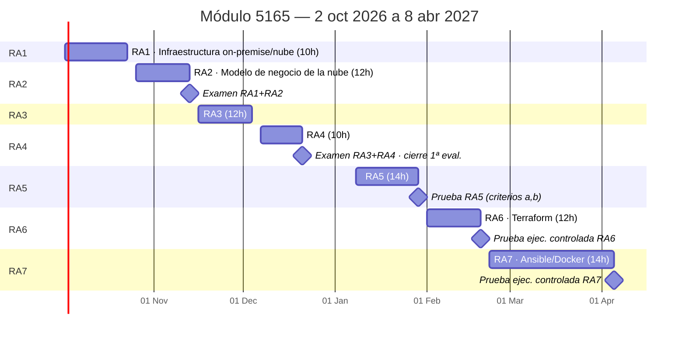

# 📅 Calendario y evaluación — módulo 5165

[← Volver al índice](index.md)

> **Borrador / modelo vivo.** Esta página se irá ajustando durante el curso — no la des por cerrada.

## ⚠️ 84h reales, no 90h

Contando los festivos autonómicos y locales de Castellón para el curso 2026-2027, entre el **2 de octubre de 2026** y el **8 de abril de 2027** (fecha en la que el alumnado pasa a FCT) hay **42 sesiones de clase** — lunes y viernes, 2h cada una — es decir, **84h reales**.

La suma de horas de los 7 RA (10+12+12+10+14+12+14 = 84h) encaja exacta con esas 84h disponibles: el margen de 6h previsto como colchón queda **a cero**. Cualquier baja, festivo local añadido o imprevisto obliga a recortar contenido de algún RA — no hay sesiones de reserva.

### Festivos considerados

| Fecha(s) | Motivo |
| --- | --- |
| Vie 9 y Lun 12 oct 2026 | Día de la Comunitat Valenciana + Fiesta Nacional (puente) |
| Mar 8 dic 2026 | Inmaculada Concepción *(no cae en día de clase)* |
| Mar 22 dic 2026 – Mié 6 ene 2027 | Vacaciones de Navidad |
| Lun 1 – Vie 5 mar 2027 | Semana de la Magdalena (festivo local de Castellón) |
| Vie 19 mar 2027 | San José |
| Jue 25 mar – Vie 2 abr 2027 | Semana Santa (calendario local de Castellón) |

> Pendiente de confirmar: la semana de la Magdalena está aprobada por el Consell Escolar Municipal pero, a fecha de este borrador, sigue pendiente de ratificación por la Dirección Territorial de Educación.

## 🗓️ Vista general del curso

## 📋 Calendario sesión a sesión

| # | Fecha | RA | Evaluación |
| --- | --- | --- | --- |
| 1 | 02-oct-2026 (Vie) | RA1 | |
| 2 | 05-oct-2026 (Lun) | RA1 | |
| 3 | 16-oct-2026 (Vie) | RA1 | |
| 4 | 19-oct-2026 (Lun) | RA1 | |
| 5 | 23-oct-2026 (Vie) | RA1 | |
| 6 | 26-oct-2026 (Lun) | RA2 | |
| 7 | 30-oct-2026 (Vie) | RA2 | |
| 8 | 02-nov-2026 (Lun) | RA2 | |
| 9 | 06-nov-2026 (Vie) | RA2 | |
| 10 | 09-nov-2026 (Lun) | RA2 | |
| 11 | 13-nov-2026 (Vie) | RA2 | 🟥 **Examen RA1+RA2** (bloques separados) |
| 12 | 16-nov-2026 (Lun) | RA3 | |
| 13 | 20-nov-2026 (Vie) | RA3 | |
| 14 | 23-nov-2026 (Lun) | RA3 | |
| 15 | 27-nov-2026 (Vie) | RA3 | |
| 16 | 30-nov-2026 (Lun) | RA3 | |
| 17 | 04-dic-2026 (Vie) | RA3 | |
| 18 | 07-dic-2026 (Lun) | RA4 | |
| 19 | 11-dic-2026 (Vie) | RA4 | |
| 20 | 14-dic-2026 (Lun) | RA4 | |
| 21 | 18-dic-2026 (Vie) | RA4 | |
| 22 | 21-dic-2026 (Lun) | RA4 | 🟥 **Examen RA3+RA4** — cierre 1ª evaluación |
| 23 | 08-ene-2027 (Vie) | RA5 | |
| 24 | 11-ene-2027 (Lun) | RA5 | |
| 25 | 15-ene-2027 (Vie) | RA5 | |
| 26 | 18-ene-2027 (Lun) | RA5 | |
| 27 | 22-ene-2027 (Vie) | RA5 | |
| 28 | 25-ene-2027 (Lun) | RA5 | |
| 29 | 29-ene-2027 (Vie) | RA5 | 🟥 **Prueba RA5** (criterios a, b) |
| 30 | 01-feb-2027 (Lun) | RA6 | |
| 31 | 05-feb-2027 (Vie) | RA6 | |
| 32 | 08-feb-2027 (Lun) | RA6 | |
| 33 | 12-feb-2027 (Vie) | RA6 | |
| 34 | 15-feb-2027 (Lun) | RA6 | |
| 35 | 19-feb-2027 (Vie) | RA6 | 🟩 **Prueba de ejecución controlada** (Terraform) |
| 36 | 22-feb-2027 (Lun) | RA7 | |
| 37 | 26-feb-2027 (Vie) | RA7 | |
| 38 | 08-mar-2027 (Lun) | RA7 | |
| 39 | 12-mar-2027 (Vie) | RA7 | |
| 40 | 15-mar-2027 (Lun) | RA7 | |
| 41 | 22-mar-2027 (Lun) | RA7 | |
| 42 | 05-abr-2027 (Lun) | RA7 | 🟩 **Prueba de ejecución controlada** (Ansible/Docker) — último día antes de FCT |

## 📝 Pendiente de decidir

- Confirmar con el departamento si el PCC exige examen formal para RA6 y RA7, o si la prueba de ejecución controlada es suficiente.
- Confirmar oficialmente la semana de la Magdalena cuando el Ayuntamiento la ratifique.
- Decidir si hace falta alguna sesión de repaso antes de cada examen (actualmente no hay ninguna reservada).

---
[← Volver al índice](index.md)
